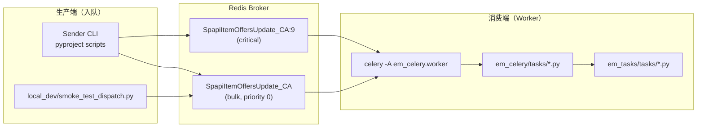

# 程序入口指南

本文说明 `em-spapi-celery` 所有可执行入口、目录职责，以及建议的阅读顺序。与 [TECHNICAL.md](./TECHNICAL.md) 互补：本文偏「从哪启动、从哪读代码」，TECHNICAL 偏架构与运维。

---

## 1. 总体结构

本项目**没有**单一的 `main.py`。运行时分两条主线：



| 角色 | 做什么 | 典型入口 |
|------|--------|----------|
| **Sender** | 读 ASIN → 过滤 TTL → `apply_async` 写入 Redis | `spapi_item_offers_task_sender` |
| **Worker** | 从 Redis 取 task → 调 SP-API → 写 ES | `celery -A em_celery.worker worker` |
| **同步脚本** | 绕过 Celery，直接调业务类 | `spapi_fetch_item_offers_sync` |

---

## 2. Worker 入口（消费 task）

### 2.1 Celery 应用

**文件：** `em_celery/worker.py`

```python
import em_celery.scheduling.kombu_priority_patch  # 优先级队列 patch，必须最先加载

app = Celery('em_celery')
app.config_from_object('em_celery.config')
app.autodiscover_tasks(['em_celery'], force=True)
```

- `app`：全局 Celery 实例
- `config_from_object('em_celery.config')`：broker、ACK、优先级等
- `autodiscover_tasks`：扫描 `em_celery.tasks` 包，加载 `@app.task` 装饰的函数

**手动启动：**

```bash
export BROKER_URL=redis://127.0.0.1:6379/0
celery -A em_celery.worker worker \
  -Q SpapiItemOffersUpdate_US,SpapiCatalogItemsUpdate_US \
  -l info --concurrency 1
```

### 2.2 本地 / 生产启动脚本

| 环境 | 入口文件 | 说明 |
|------|----------|------|
| 本地 | `local_dev/run_local_worker.sh` | 监听单个 marketplace 的 catalog + offer 队列 |
| 生产 offer | `deploy/systemd/em-spapi-celery-offer-worker.service` → `deploy/bin/run-worker.sh offer` | 读 `/etc/conf.d/em_celery` 中 `CELERY_OFFER_QUEUES` |
| 生产 catalog | `deploy/systemd/em-spapi-celery-catalog-worker.service` → `run-worker.sh catalog` | 读 `CELERY_CATALOG_QUEUES` |

`run-worker.sh` 通过 `em_celery.runtime.get_worker_settings()` 解析队列名、并发数、日志级别，再 `exec celery -A em_celery.worker worker ...`。

### 2.3 Worker 进程初始化

`em_celery/worker.py` 中 `@worker_process_init.connect` 在每个 fork 子进程里预创建 ES 统计索引（catalog / offer task stats）。

---

## 3. Sender CLI 入口（往队列塞 task）

定义在 `pyproject.toml` → `[project.scripts]`，`uv sync` 后安装为 shell 命令。

| 命令 | Python 模块:函数 | 数据源 |
|------|------------------|--------|
| `spapi_item_offers_task_sender` | `em_celery.tools.spapi_update_item_offers_task_sender:send_spapi_item_offers_update_task` | ASIN 文件 |
| `spapi_item_offers_task_send_from_es` | `...task_send_from_es:send_spapi_item_offers_update_task` | ES `amz_asins_{mp}_no_offer` |
| `spapi_all_item_offers_task_send_from_es` | `...all_item_offers...:send_spapi_item_offers_update_task` | 全 marketplace ES 循环 |
| `spapi_catalog_items_task_sender` | `...catalog_items_task_sender:...` | ASIN 文件 |
| `spapi_catalog_items_task_send_from_es` | `...catalog_items_task_send_from_es:...` | ES |
| `spapi_all_catalog_items_task_send_from_es` | `...all_catalog_items...:...` | 全 marketplace |
| `spapi_fetch_item_offers_sync` | `em_celery.tools.spapi_fetch_item_offers_sync:fetch_item_offers_sync` | 同步拉 offer，**不经 Celery、不读队列**（见 [SYNC_FETCH_OFFERS.md](./SYNC_FETCH_OFFERS.md)） |

每个 sender 文件结构相同：

```
@click.command(...)          ← CLI 入口（Click 装饰的函数）
def send_spapi_*_update_task(...):
    sender = Spapi*TaskSender(...)
    sender.run()             ← 业务循环

class Spapi*TaskSender:
    def run(self): ...       ← 读 ASIN / 扫 ES
    def process_products(...): ...  ← TTL 过滤 + apply_async
```

共享工具：`em_celery/tools/_sender_common.py`（broker URL 解析、`broker_connection()`、日志）。

---

## 4. 配置与服务工厂入口

**文件：** `em_celery/__init__.py`

import 该模块时会：

1. 加载 `~/.em_celery/config.ini`
2. 注册无效 ASIN 信号处理

对外工厂函数：

| 函数 | 返回 | 配置段 |
|------|------|--------|
| `get_config()` | 完整 INI dict | — |
| `get_spapi()` | `em_tasks.spapi.Spapi` | `[spapi]` |
| `get_product_service()` | `ProductService` | `[product_service]` |
| `get_offer_service()` | `EsOfferService` | `[offer_service]` |
| `get_bot()` | Telegram bot | `[telegram]` |

路径解析：`em_celery/paths.py`  
Celery 专用配置：`em_celery/config.py`

---

## 5. Task 调用链（读代码时的主线）

以 **Offer** 为例：

```
① Sender CLI
   em_celery/tools/spapi_update_item_offers_task_sender.py
   └── apply_async(args=(marketplace, asins, condition), queue=..., connection=...)

② Redis 队列
   SpapiItemOffersUpdate_{MP} 或 SpapiItemOffersUpdate_{MP}:9

③ Celery Worker 消费
   em_celery/worker.py → app 收到消息

④ Celery Task 包装层（异常、限流、告警）
   em_celery/tasks/spapi_update_item_offers_task.py
   └── @app.task(rate_limit='8/m') def spapi_update_item_offers(...)

⑤ 业务逻辑层
   em_tasks/tasks/spapi_update_item_offers_task.py
   └── class SpapiUpdateItemOffersTask.run()

⑥ SP-API 客户端
   em_tasks/spapi/__init__.py
   └── Spapi.get_item_offers_batch()

⑦ 写入 ES
   vendor/dropshipping/.../offer_services.py
   └── EsOfferService.save_item_offers()
   → 索引 lowest_offer_listings_{mp}_{condition}
```

**Catalog** 路径类似，替换为 `spapi_update_catalog_items` 与 `SpapiUpdateCatalogItemsTask`。

Celery 包装层依赖 `em_celery/tasks/base.py` 的 `BaseTask`，懒加载 `spapi`、`offer_service`、`product_service`、`bot`。

---

## 6. 本地测试入口（无需生产 SP-API 授权）

| 文件 | 层级 | 需要 Redis | 需要 ES | 需要 SP-API |
|------|------|:----------:|:-------:|:-----------:|
| `local_dev/smoke_test_dispatch.py` | L1 入队冒烟 | ✓ | ✗ | ✗ |
| `local_dev/inspect_queue.py` | 查看/清空队列（含优先级子队列） | ✓ | ✗ | ✗ |
| `local_dev/run_local_worker.sh` | 启动本地 worker | ✓ | ✓* | ✓* |
| `tests/scheduling/test_priority*.py` | 优先级单元/集成测试 | ✓ | ✗ | ✗ |

\* Worker 执行 task 时才需要 ES / SP-API；仅验证「取到 task」则 L1 足够。

详见 [local_dev/LOCAL_TESTING.md](../local_dev/LOCAL_TESTING.md)。

---

## 7. 目录职责速查

```
em-spapi-celery/
├── em_celery/                  # Celery 编排层
│   ├── worker.py               # ★ Worker 入口
│   ├── config.py               # Celery / broker / priority 配置
│   ├── __init__.py             # ★ 配置与服务工厂
│   ├── runtime.py              # 生产 worker 队列/并发解析
│   ├── tasks/                  # @app.task 薄包装
│   ├── tools/                  # ★ Sender CLI 入口
│   └── scheduling/             # 优先级队列（priority + kombu patch）
├── em_tasks/                   # 业务层
│   ├── tasks/                  # ★ SpapiUpdate*Task 实现
│   └── spapi/                  # SP-API 封装
├── deploy/                     # systemd、install.sh、run-worker.sh
├── local_dev/                  # 本地测试脚本
├── tests/                      # pytest
└── docs/                       # 文档
    ├── TECHNICAL.md
    ├── ENTRY_POINTS.md         # 本文
    ├── OFFER_PIPELINE.md       # Offer 端到端代码走读
    └── PRIORITY_QUEUE.md       # 优先级队列机制
```

---

## 8. 建议学习顺序

1. **`em_celery/worker.py` + `config.py`** — Celery 如何启动、监听哪些队列
2. **`em_celery/tools/spapi_update_item_offers_task_sender.py`** — task 如何入队
3. **[OFFER_PIPELINE.md](./OFFER_PIPELINE.md)** — 从入队到写 ES 逐步走读
4. **`em_celery/tasks/spapi_update_item_offers_task.py`** — Celery 层异常与 rate limit
5. **`em_tasks/tasks/spapi_update_item_offers_task.py`** — 核心业务
6. **[SPAPI_CORE.md](./SPAPI_CORE.md)** — SP-API 如何发起请求、返回什么、如何转换
7. **[SPAPI_RATE_LIMITING.md](./SPAPI_RATE_LIMITING.md)** — 限流、Celery 多进程如何（不）协调速率
8. **[PRIORITY_QUEUE.md](./PRIORITY_QUEUE.md)** — 优先级子队列机制
9. **`em_celery/__init__.py`** — 配置与外部依赖接入
10. **`deploy/bin/run-worker.sh` + systemd unit** — 生产部署
