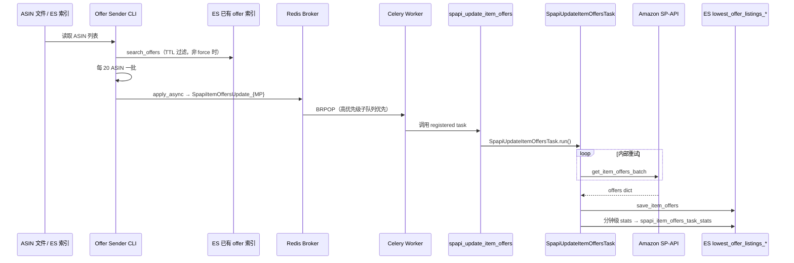
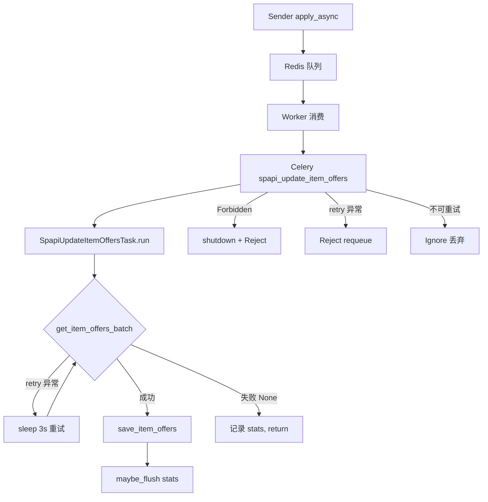

# Offer 端到端流程：从入队到写 ES

本文按**代码执行顺序**逐步说明一条 Offer task 从 Sender 入队到 Elasticsearch 落库的完整路径。配合 [ENTRY_POINTS.md](./ENTRY_POINTS.md) 与 [PRIORITY_QUEUE.md](./PRIORITY_QUEUE.md) 阅读。

---

## 1. 流程总览



---

## 2. 阶段一：Sender 入队

### 2.1 CLI 入口

**文件：** `em_celery/tools/spapi_update_item_offers_task_sender.py`

```python
@click.command(...)
def send_spapi_item_offers_update_task(asins_path, broker_url, ...):
    broker_url = normalize_broker(broker_url)          # BROKER_URL 或 -b
    sender = SpapiUpdateItemOffersTaskSender(...)
    sender.run()
```

安装后的命令：`spapi_item_offers_task_sender -b redis://... -m us -f asins.txt`

### 2.2 初始化

```python
class SpapiUpdateItemOffersTaskSender():
  def __init__(self, ...):
    self.offer_service = get_offer_service()           # em_celery/__init__.py → [offer_service]
    self.connection = broker_connection(broker_url)    # 带 priority transport_options
    self.queue = 'SpapiItemOffersUpdate_{}'.format(marketplace.upper())
```

- `get_offer_service()`：连接 Offer 专用 ES，用于 **Sender 端 TTL 过滤**（查已有 offer 是否过期）
- `broker_connection()`：见 `em_celery/tools/_sender_common.py`，确保入队时 Kombu 识别 `priority_steps`

### 2.3 读取 ASIN

`run()` 从文件逐行读取，校验 ASIN 格式（`dropshipping.utils.is_asin_valid`），缓冲到 500 个一批调用 `process_products()`。

ES 数据源 sender（`spapi_update_item_offers_task_send_from_es.py`）改为从 `amz_asins_{mp}_no_offer` 扫描，逻辑相同，外层多队列长度控制（≥10000 暂停）。

### 2.4 TTL 过滤（Sender 端，非 force）

**文件：** `spapi_update_item_offers_task_sender.py` → `process_products()`

```python
if self.force:
    asins_without_offer = list(asins)
else:
    offer_expire_time = now - timedelta(hours=self.ttl)   # 默认 ttl=36 小时
    result = self.offer_service.search_offers(
        'lowest_offer_listings', asins, marketplace, condition)
    # 对每个 ASIN：无记录 / 无 offers / time 已过期 → 加入待发送列表
```

| 条件 | 行为 |
|------|------|
| `-f` / `force=True` | 跳过 ES 查询，全部发送 |
| 无 `-f` | 仅发送「无 offer 或已过期」的 ASIN |
| ES 中 `time` 仍新于 `now - ttl` | 跳过（`[ASINHasOffer]` debug 日志） |

> **注意：** Celery task 签名里的 `ttl` / `force` 参数在 Worker 侧**未使用**；过滤只在 Sender 完成。

### 2.5 分批入队

```python
chunks = [asins_without_offer[x:x + 20] for x in range(0, len(asins_without_offer), 20)]
for chunk in chunks:
    # 可选 QPS 限流
    spapi_update_item_offers.apply_async(
        args=(self.marketplace, chunk, self.condition),
        queue=self.queue,
        connection=self.connection)
```

| 项 | 值 |
|----|-----|
| 每 task ASIN 数 | **20**（SP-API batch 上限） |
| 目标队列 | `SpapiItemOffersUpdate_{MARKETPLACE}`，如 `SpapiItemOffersUpdate_US` |
| 默认 priority | **0**（bulk，Redis key 无后缀） |
| task 参数 | `(marketplace, asins, condition)`，`condition` 默认 `new` |

高优先级入队见 [PRIORITY_QUEUE.md](./PRIORITY_QUEUE.md) 中的 `dispatch_task(..., priority=9)`。

---

## 3. 阶段二：Redis 存储

Celery + Redis 将每条消息序列化为 JSON，LPUSH 到 list：

| priority | Redis list key |
|----------|----------------|
| 0（bulk，默认） | `SpapiItemOffersUpdate_US` |
| 9（critical） | `SpapiItemOffersUpdate_US:9` |
| 5 | `SpapiItemOffersUpdate_US:5` |

查看队列：

```bash
python local_dev/inspect_queue.py --broker "$BROKER_URL" --marketplace us --verbose
```

---

## 4. 阶段三：Worker 消费

### 4.1 Worker 启动

```bash
celery -A em_celery.worker worker -Q SpapiItemOffersUpdate_US ...
```

**文件：** `em_celery/worker.py`

1. import `kombu_priority_patch`（消费时 `:9` 先于无后缀）
2. 创建 `app`，加载 `em_celery.config`
3. `autodiscover_tasks` 注册 `spapi_update_item_offers`

### 4.2 取消息

Kombu Redis Channel 的 `_brpop_start` / `_get` 被 patch 为按 `9 → 8 → … → 0` 顺序检查子队列（详见 PRIORITY_QUEUE.md）。

Worker 的 `-Q` 只需写**逻辑队列名**（无后缀），如 `SpapiItemOffersUpdate_CA`。`em_celery/runtime.py` 会把配置里误写的 `SpapiItemOffersUpdate_CA:9` 归一化为 base name。

### 4.3 Celery 调度

- `rate_limit='8/m'`：每个 worker 进程每分钟最多 8 条 offer task
- `acks_late=True`：执行成功后才 ACK
- `worker_prefetch_multiplier=1`：配合优先级，避免 prefetch 占满低优消息

---

## 5. 阶段四：Celery Task 包装层

**文件：** `em_celery/tasks/spapi_update_item_offers_task.py`

```python
@app.task(base=BaseTask, bind=True, acks_late=True, rate_limit='8/m')
def spapi_update_item_offers(self, marketplace, asins, condition='new', ttl=24, force=False, callback=None):
    task = SpapiUpdateItemOffersTask(
        self.spapi,              # BaseTask 懒加载 Spapi 客户端
        self.offer_service,      # EsOfferService
        marketplace, asins, condition,
        product_service=self.product_service,   # 用于写 task stats
        worker=build_worker_meta(self.request),  # worker_id / pid / host
    )
    try:
        task.run()
    except (SellingApiForbiddenException, AuthorizationError):
        # Telegram 告警 + 广播 shutdown + Reject(requeue=True)
    except exceptions_to_retry:
        # Reject(requeue=True)，累计 250 次发 Telegram
    except exceptions_not_retry:
        # Ignore（丢弃）
    except Exception:
        # Ignore
```

**BaseTask**（`em_celery/tasks/base.py`）在每个 worker 进程内懒加载：

- `[spapi]` 凭证 → `Spapi(credentials)`
- `[offer_service]` → `EsOfferService`
- `[product_service]` → `ProductService`

---

## 6. 阶段五：业务逻辑 `SpapiUpdateItemOffersTask.run()`

**文件：** `em_tasks/tasks/spapi_update_item_offers_task.py`

### 6.1 调用 SP-API

```python
offers = self.spapi.get_item_offers_batch(self.marketplace, self.asins, self.condition)
```

**文件：** `em_tasks/spapi/__init__.py` → `get_item_offers_batch()`

1. 构造 batch 请求：每个 ASIN 一条 `GET /products/pricing/v0/items/{asin}/offers`
2. 调用 `sp_products_api.get_item_offers_batch(requests)`
3. `SpItemOfferBatchConverter.convert(responses)` 转为 `{asin: {offers, summary, time}}`
4. 对 API 未返回的 ASIN 补空 offer：`{'asin', 'offers': [], 'summary': '', 'time': now}`

**重试（Layer 2）：**

| 异常 | 行为 |
|------|------|
| `exceptions_to_retry` | `sleep(3)` 后循环重试 |
| `SellingApiInvalidAsinException` / `SellingApiBadRequestException` | break，`offers` 可能为 None |
| `SellingApiForbiddenException` | 向上抛出，由 Celery 层处理 |
| `exceptions_not_retry` | break |

SP-API 类内部还有最多 12 次重试（Layer 1，sleep 递增）。

### 6.2 API 完全失败

```python
if offers is None:
    self._record_stats(..., api_failed=1)
    self.maybe_flush()
    return
```

不写 offer 索引，仍可能记录分钟级 stats。

### 6.3 写入 Offer ES

```python
successful_asins, failed_asins = _count_offer_results(self.asins, offers)
result = self.offer_service.save_item_offers(
    'lowest_offer_listings', offers, self.marketplace, self.condition)
```

**文件：** `vendor/dropshipping/dropshipping/utils/offer_services.py` → `EsOfferService.save_item_offers()`

| 项 | 值 |
|----|-----|
| 索引名 | `lowest_offer_listings_{marketplace}_{condition}` |
| condition | `new` 保持；其他归一为 `any` |
| 文档 `_id` | ASIN |
| `_source` 字段 | `asin`, `offers` (JSON string), `summary` (JSON string), `time` (UTC 写入时刻) |

示例索引：`lowest_offer_listings_us_new`

### 6.4 运行统计（可选，需 product_service）

`_record_stats()` 按 **worker_id + marketplace + 分钟** 聚合：

- `num_asins`, `successful_asins`, `failed_asins`
- `task_duration_ms`, `spapi_duration_ms`, `fetch_gap_ms`
- `api_failed`, `task_count`

`maybe_flush()` 在分钟切换时写入 **`spapi_item_offers_task_stats`**（通过 `ProductService.save_products`），文档结构见 `em_tasks/tasks/task_stats_doc.py` → `build_offer_stats_doc()`。

---

## 7. 阶段六：异常与重试总结



| 层级 | 位置 | 策略 |
|------|------|------|
| Layer 1 | `em_tasks/spapi/Spapi` | 最多 12 次，限流/5xx sleep |
| Layer 2 | `SpapiUpdateItemOffersTask.run` | `exceptions_to_retry` → sleep 3s 循环 |
| Layer 3 | `em_celery/tasks/spapi_update_item_offers_task.py` | Forbidden → shutdown；retry → Reject；其他 → Ignore |

---

## 8. 相关索引一览

| 索引 | 方向 | 说明 |
|------|------|------|
| `amz_asins_{mp}_no_offer` | Sender 读 | 待补 offer 的 ASIN 池（ES sender） |
| `lowest_offer_listings_{mp}_{cond}` | Worker 写 | 主 offer 数据 |
| `spapi_item_offers_task_stats` | Worker 写 | 分钟级运行指标 |
| `spapi_item_offers_missing_asins` | 预创建 | worker init 创建，当前业务未写入 |

---

## 9. 同步路径（不经 Celery）

> 完整说明见 [SYNC_FETCH_OFFERS.md](./SYNC_FETCH_OFFERS.md)。

**命令：** `spapi_fetch_item_offers_sync`  
**文件：** `em_celery/tools/spapi_fetch_item_offers_sync.py`

**不读 Redis 队列**；在当前进程直接实例化 `SpapiUpdateItemOffersTask` 并 `run()`，与 Worker 共用同一业务类与 ES 写入逻辑，但跳过 Celery 包装层（rate limit、Reject/Ignore、task stats 等）。

---

## 10. 本地验证（无需生产授权）

```bash
export BROKER_URL=redis://127.0.0.1:6379/0

# L1：仅测入队
python local_dev/smoke_test_dispatch.py --offers-only --marketplace us
python local_dev/inspect_queue.py --broker "$BROKER_URL" --marketplace us

# L3：测消费（需 config.ini 中 SP-API + ES）
bash local_dev/run_local_worker.sh
```

完整分层说明见 [local_dev/LOCAL_TESTING.md](../local_dev/LOCAL_TESTING.md)。
