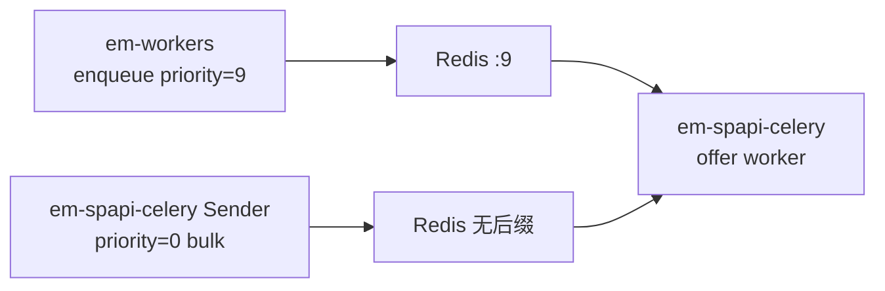

# Redis 优先级队列机制

本文说明 `em-spapi-celery` 如何与 [em-workers](https://github.com/AriseshineSky/em-workers) 对齐，实现 Celery + Redis 的 **0–9 优先级子队列**，以及 Worker **先消费高后缀、最后消费 bulk 无后缀队列** 的行为。

相关代码：`em_celery/scheduling/`  
测试：`tests/scheduling/test_priority.py`、`tests/scheduling/test_priority_integration.py`

---

## 1. 设计目标

| 需求 | 实现 |
|------|------|
| 高优 task 先入先出 | `priority=9` → Redis list `QueueName:9` |
| 批量/backfill 最低优 | `priority=0` → Redis list `QueueName`（**无后缀**） |
| Worker 先取 urgent | BRPOP 顺序：`:9` → `:8` → … → `:1` → 无后缀 |
| 与 em-workers 互通 | 相同 `priority_steps`、`sep`、`kombu patch` 语义 |
| 现有 Sender 行为不变 | `task_default_priority = 0`，不传 priority 仍进 bulk 队列 |

---

## 2. Redis 上的队列形态

逻辑队列名：`SpapiItemOffersUpdate_CA`（Worker `-Q` 与 Sender `queue=` 使用此名）

物理 Redis keys（每个 priority 一个 list）：

```
SpapiItemOffersUpdate_CA:9   ← priority 9（最高）
SpapiItemOffersUpdate_CA:8
...
SpapiItemOffersUpdate_CA:1
SpapiItemOffersUpdate_CA     ← priority 0（bulk，无后缀，最低）
```

Catalog 队列同理：`SpapiCatalogItemsUpdate_US:9` 等。

### 优先级常量

**文件：** `em_celery/scheduling/priority.py`

| 常量 | 值 | 含义 |
|------|-----|------|
| `PRIORITY_BULK` | 0 | 批量/backfill |
| `PRIORITY_LOW` | 3 | 低 |
| `PRIORITY_NORMAL` | 5 | 普通 |
| `PRIORITY_HIGH` | 7 | 高 |
| `PRIORITY_CRITICAL` | 9 | 最高 |

---

## 3. 入队：Producer 如何把消息放进正确 list

### 3.1 Celery 配置

**文件：** `em_celery/config.py`

```python
task_default_priority = 0          # 未指定时 → bulk（无后缀）
task_queue_max_priority = 9
broker_transport_options = {
    "priority_steps": [0, 1, ..., 9],
    "sep": ":",
    "queue_order_strategy": "priority",
}
worker_prefetch_multiplier = 1       # 避免 prefetch 饿死高优队列
```

Kombu 根据 `apply_async(priority=N)` 决定 LPUSH 到 `queue` 还是 `queue:N`。

### 3.2 Sender 连接

**文件：** `em_celery/tools/_sender_common.py`

```python
def broker_connection(broker_url: str) -> Connection:
    return Connection(broker_url, transport_options=broker_transport_options())
```

所有 Sender 使用 `broker_connection()`，确保 CLI 入队与 Worker 使用相同 transport 语义。

### 3.3 本项目 Sender 的默认行为

现有 offer/catalog Sender 调用：

```python
spapi_update_item_offers.apply_async(
    args=(marketplace, chunk, condition),
    queue=self.queue,
    connection=self.connection,
    # 未传 priority → task_default_priority=0 → 无后缀 bulk 队列
)
```

因此 **本项目自己产生的 task 全是 bulk**；高优消息通常来自 **em-workers** 或显式调用 `dispatch_task(..., priority=9)`。

### 3.4 高优先级入队 API

**文件：** `em_celery/scheduling/send.py`

```python
from em_celery.scheduling.send import dispatch_task, PRIORITY_CRITICAL

dispatch_task(
    spapi_update_item_offers,
    args=("ca", ["B0XXXX"], "new"),
    queue="SpapiItemOffersUpdate_CA",
    connection=broker_connection(broker_url),
    priority=9,   # → SpapiItemOffersUpdate_CA:9
)
```

`normalize_user_priority()` 将 0–9 以外的值钳制到范围内；`None` 视为 `PRIORITY_NORMAL`（5）。

---

## 4. 出队：Worker 如何先取高优

### 4.1 Patch 入口

**文件：** `em_celery/worker.py`（必须最先 import）

```python
import em_celery.scheduling.kombu_priority_patch  # noqa: F401
```

模块加载时执行 `apply_kombu_priority_patch()`，替换 Kombu Redis `Channel._get` 与 `_brpop_start`。

### 4.2 消费顺序

**文件：** `em_celery/scheduling/kombu_priority_patch.py`

```python
def _consume_priority_steps(channel):
    return reversed(channel.priority_steps)   # 9, 8, ..., 0
```

`_get(queue)` 伪代码：

```python
for pri in [9, 8, ..., 0]:
    item = redis.rpop(_q_for_pri(queue, pri))
    if item:
        return deserialize(item)
raise Empty()
```

`_brpop_start` 对活跃队列构造 BRPOP key 列表，同样 **高 pri 在前**。

### 4.3 为何需要 patch

Kombu 默认 Redis priority 实现中，**LPUSH 映射**与 **BRPOP 顺序** 在「9 最高、0 无后缀最低」语义下需反转消费顺序；`priority_steps` 保持升序 `[0..9]` 以保证 **入队** 时 `priority=9` 仍写入 `:9`，patch 只改 **出队** 顺序。

这与 em-workers 的 `amazon_spapi/scheduling/kombu_priority_patch.py` 一致。

---

## 5. Worker 队列配置归一化

**文件：** `em_celery/runtime.py`

若 `/etc/conf.d/em_celery` 中写了：

```
CELERY_OFFER_QUEUES=SpapiItemOffersUpdate_CA,SpapiItemOffersUpdate_CA:9
```

`get_worker_settings()` 会通过 `base_queue_name()`  strip 后缀，最终 Celery `-Q` 为：

```
SpapiItemOffersUpdate_CA
```

**原因：** 优先级子队列由 Kombu 在**同一个逻辑队列名**下管理，不应把 `:9` 当作独立 Celery queue 注册。

---

## 6. 队列深度统计

Sender 背压逻辑（是否继续发送、是否队列已满）需统计**所有** priority 子队列之和。

**文件：** `em_celery/scheduling/priority.py`

```python
redis_priority_queue_depth(redis_client, "SpapiItemOffersUpdate_US")
# = llen(US:9) + llen(US:8) + ... + llen(US)
```

`iter_redis_priority_queue_keys()` 按 **9 → 0** 顺序 yield key，供 `inspect_queue.py --verbose` 与 purge 使用。

---

## 7. 与 em-workers 混跑



- em-workers 高优 refresh → `SpapiItemOffersUpdate_CA:9`
- 本项目 bulk sender → `SpapiItemOffersUpdate_CA`
- 同一 offer worker 监听 `SpapiItemOffersUpdate_CA`，**永远先清空 :9 再处理 bulk**

---

## 8. 测试

### 8.1 单元测试

```bash
pytest tests/scheduling/test_priority.py -q
```

覆盖：priority 映射、queue key 顺序、`dispatch_task` 传参。

### 8.2 集成测试（本地 Redis，无需 SP-API）

```bash
TEST_BROKER_URL=redis://127.0.0.1:6379/15 pytest tests/scheduling/test_priority_integration.py -q
```

验证：

1. `priority=0` 与 `priority=9` 分别进入无后缀与 `:9` list
2. 先 bulk 后 high 入队，`_get()` 仍先弹出 high

### 8.3 手动检查

```bash
export BROKER_URL=redis://127.0.0.1:6379/0
python local_dev/inspect_queue.py --broker "$BROKER_URL" --marketplace ca --verbose
```

---

## 9. 常见问题

**Q：配置了 `SpapiItemOffersUpdate_CA:9` 作为 Worker 队列，会只消费 :9 吗？**  
A：归一化后 Worker 绑定 `SpapiItemOffersUpdate_CA`，自动覆盖全部 10 个 priority 子队列；不会只监听 `:9`。

**Q：本项目 Sender 发的 offer 有优先级吗？**  
A：默认没有，全是 bulk（无后缀）。要发高优请用 `dispatch_task(..., priority=9)` 或从 em-workers 入队。

**Q：Catalog 队列支持优先级吗？**  
A：机制通用，catalog 队列同样支持 `:1`–`:9` 子队列；当前 catalog Sender 也未传 priority。

**Q：如何确认线上 Worker 已加载 patch？**  
A：部署版本需包含 `em_celery/scheduling/`，且 `worker.py` 第一行 import patch；重启 worker 后可用 `--verbose` 观察 `:9` 是否被优先消费（高优入队后 bulk 积压不变、:9 先减）。

---

## 10. 文件索引

| 文件 | 职责 |
|------|------|
| `em_celery/scheduling/priority.py` | 常量、映射、`base_queue_name`、`redis_priority_queue_depth` |
| `em_celery/scheduling/kombu_priority_patch.py` | `broker_transport_options`、Channel patch |
| `em_celery/scheduling/send.py` | `dispatch_task()` 入队辅助 |
| `em_celery/config.py` | Celery priority 配置 |
| `em_celery/worker.py` | import patch |
| `em_celery/runtime.py` | Worker 队列名归一化 |
| `em_celery/tools/_sender_common.py` | `broker_connection()` |
| `local_dev/inspect_queue.py` | 运维查看子队列 |
| `tests/scheduling/` | 自动化测试 |
