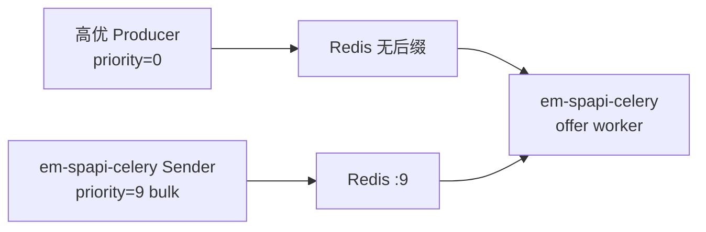

# Redis 优先级队列机制

本文说明 `em-spapi-celery` 如何使用 Celery 官方推荐的 Redis 优先级语义：**0–9 优先级子队列**，Worker **先消费无后缀队列（priority 0），最后消费 `:9`（bulk）**。

相关代码：`em_celery/scheduling/`  
测试：`tests/scheduling/test_priority.py`、`tests/scheduling/test_priority_integration.py`

参考：[Celery Routing — Redis Message Priorities](https://docs.celeryq.dev/en/stable/userguide/routing.html#redis-message-priorities)

---

## 1. 设计目标

| 需求 | 实现 |
|------|------|
| 高优 task 先入先出 | `priority=0` → Redis list `QueueName`（**无后缀，最高**） |
| 批量/backfill 最低优 | `priority=9` → Redis list `QueueName:9` |
| Worker 先取 urgent | BRPOP 顺序：无后缀 → `:1` → … → `:9`（Kombu 默认，无需 patch） |
| 与 Celery 文档一致 | `priority_steps` + `sep: ":"` + `queue_order_strategy: priority` |
| 现有 Sender 行为不变 | `task_default_priority = 9`，不传 priority 仍进 bulk（`:9`） |

> **注意：** Redis 下 Celery 的 priority **与 RabbitMQ 相反**——数字越小优先级越高。`0` 最高，`9` 最低。

---

## 2. Redis 上的队列形态

逻辑队列名：`SpapiItemOffersUpdate_CA`（Worker `-Q` 与 Sender `queue=` 使用此名）

物理 Redis keys（每个 priority 一个 list，与 Celery 文档一致）：

```
SpapiItemOffersUpdate_CA     ← priority 0（最高，critical）
SpapiItemOffersUpdate_CA:1
...
SpapiItemOffersUpdate_CA:8
SpapiItemOffersUpdate_CA:9   ← priority 9（bulk，最低）
```

Catalog 队列同理：`SpapiCatalogItemsUpdate_US`、`:1` … `:9`。

### 优先级常量

**文件：** `em_celery/scheduling/priority.py`

| 常量 | 值 | 含义 | Redis key |
|------|-----|------|-----------|
| `PRIORITY_CRITICAL` | 0 | 最高 | 无后缀 |
| `PRIORITY_HIGH` | 2 | 高 | `:2` |
| `PRIORITY_NORMAL` | 5 | 普通 | `:5` |
| `PRIORITY_LOW` | 7 | 低 | `:7` |
| `PRIORITY_BULK` | 9 | 批量/backfill | `:9` |

---

## 3. 入队：Producer 如何把消息放进正确 list

### 3.1 Celery 配置

**文件：** `em_celery/config.py`

```python
task_default_priority = 9           # 未指定时 → bulk（:9）
task_queue_max_priority = 9
broker_transport_options = {
    "priority_steps": [0, 1, ..., 9],
    "sep": ":",
    "queue_order_strategy": "priority",
}
worker_prefetch_multiplier = 1       # 避免 prefetch 饿死高优队列
```

Kombu 根据 `apply_async(priority=N)` 决定 LPUSH 到 `queue`（N=0）还是 `queue:N`（N≥1）。

### 3.2 Sender 连接

**文件：** `em_celery/tools/_sender_common.py`

```python
def broker_connection(broker_url: str) -> Connection:
    return Connection(broker_url, transport_options=broker_transport_options())
```

所有 Sender 使用 `broker_connection()`，确保 CLI 入队与 Worker 使用相同 transport 语义。

### 3.3 本项目 Sender 的默认行为

现有 offer/catalog Sender 调用：

```python
spapi_update_item_offers.apply_async(
    args=(marketplace, chunk, condition),
    queue=self.queue,
    connection=self.connection,
    # 未传 priority → task_default_priority=9 → :9 bulk 队列
)
```

因此 **本项目自己产生的 task 全是 bulk（`:9`）**；高优消息需显式调用 `dispatch_task(..., priority=0)` 或 `PRIORITY_CRITICAL`。

### 3.4 高优先级入队 API

**文件：** `em_celery/scheduling/send.py`

```python
from em_celery.scheduling.send import dispatch_task, PRIORITY_CRITICAL

dispatch_task(
    spapi_update_item_offers,
    args=("ca", ["B0XXXX"], "new"),
    queue="SpapiItemOffersUpdate_CA",
    connection=broker_connection(broker_url),
    priority=PRIORITY_CRITICAL,   # 0 → SpapiItemOffersUpdate_CA（无后缀）
)
```

`normalize_user_priority()` 将 0–9 以外的值钳制到范围内；`None` 视为 `PRIORITY_NORMAL`（5）。

---

## 4. 出队：Worker 如何先取高优

### 4.1 Kombu 默认行为（无 patch）

**文件：** `em_celery/scheduling/kombu_priority_patch.py`（仅提供 `broker_transport_options()`）

Kombu Redis Channel 的 `_brpop_start` / `_get` 按 `priority_steps` 升序检查子队列：

```python
for pri in [0, 1, 2, ..., 9]:
    item = redis.rpop(_q_for_pri(queue, pri))
    if item:
        return deserialize(item)
```

即 **无后缀（0）最先**，`:9` 最后。这与 Celery 官方文档一致，**不需要**自定义 Channel patch。

### 4.2 Worker 启动

**文件：** `em_celery/worker.py`

Worker 通过 `em_celery.config` 加载 `broker_transport_options`；无需额外 import patch 模块。

---

## 5. Worker 队列配置归一化

**文件：** `em_celery/runtime.py`

若 `/etc/conf.d/em_celery` 中写了：

```
CELERY_OFFER_QUEUES=SpapiItemOffersUpdate_CA,SpapiItemOffersUpdate_CA:9
```

`get_worker_settings()` 会通过 `base_queue_name()` strip 后缀，最终 Celery `-Q` 为：

```
SpapiItemOffersUpdate_CA
```

**原因：** 优先级子队列由 Kombu 在**同一个逻辑队列名**下管理，不应把 `:9` 当作独立 Celery queue 注册。

---

## 6. 队列深度统计

Sender 背压逻辑（是否继续发送、是否队列已满）需统计**所有** priority 子队列之和。

**文件：** `em_celery/scheduling/priority.py`

```python
redis_priority_queue_depth(redis_client, "SpapiItemOffersUpdate_US")
# = llen(US) + llen(US:1) + ... + llen(US:9)
```

`iter_redis_priority_queue_keys()` 按 **0 → 9** 顺序 yield key（无后缀优先），供 `inspect_queue.py --verbose` 与 purge 使用。

---

## 7. 与外部 Producer 混跑



- 高优 refresh → `SpapiItemOffersUpdate_CA`（无后缀）
- 本项目 bulk sender → `SpapiItemOffersUpdate_CA:9`
- 同一 offer worker 监听 `SpapiItemOffersUpdate_CA`，**永远先清空无后缀队列再处理 bulk**

> 若外部系统仍使用旧语义（`priority=9` 表示最高），需在其侧改为 Celery 标准（`priority=0` 最高）或做入队映射。

---

## 8. 测试

### 8.1 单元测试

```bash
pytest tests/scheduling/test_priority.py -q
```

覆盖：priority 映射、queue key 顺序、`dispatch_task` 传参。

### 8.2 集成测试（本地 Redis，无需 SP-API）

```bash
TEST_BROKER_URL=redis://127.0.0.1:6379/15 pytest tests/scheduling/test_priority_integration.py -q
```

验证：

1. `priority=0` 与 `priority=9` 分别进入无后缀与 `:9` list
2. 先 bulk 后 critical 入队，`_get()` 仍先弹出 critical

### 8.3 手动检查

```bash
export BROKER_URL=redis://127.0.0.1:6379/0
python local_dev/inspect_queue.py --broker "$BROKER_URL" --marketplace ca --verbose
```

---

## 9. 常见问题

**Q：配置了 `SpapiItemOffersUpdate_CA:9` 作为 Worker 队列，会只消费 :9 吗？**  
A：归一化后 Worker 绑定 `SpapiItemOffersUpdate_CA`，自动覆盖全部 10 个 priority 子队列；不会只监听 `:9`。

**Q：本项目 Sender 发的 offer 有优先级吗？**  
A：默认没有，全是 bulk（`:9`）。要发高优请用 `dispatch_task(..., priority=0)` 或 `PRIORITY_CRITICAL`。

**Q：Catalog 队列支持优先级吗？**  
A：机制通用，catalog 队列同样支持无后缀 + `:1`–`:9` 子队列；当前 catalog Sender 也未传 priority（默认 `:9`）。

**Q：为何不用自定义 kombu patch？**  
A：Celery 官方 Redis 语义已是 0 最高、无后缀队列最先消费；自定义 patch 反而与文档不一致。

---

## 10. 文件索引

| 文件 | 职责 |
|------|------|
| `em_celery/scheduling/priority.py` | 常量、映射、`base_queue_name`、`redis_priority_queue_depth` |
| `em_celery/scheduling/kombu_priority_patch.py` | `broker_transport_options()` |
| `em_celery/scheduling/send.py` | `dispatch_task()` 入队辅助 |
| `em_celery/config.py` | Celery priority 配置 |
| `em_celery/runtime.py` | Worker 队列名归一化 |
| `em_celery/tools/_sender_common.py` | `broker_connection()` |
| `local_dev/inspect_queue.py` | 运维查看子队列 |
| `tests/scheduling/` | 自动化测试 |
