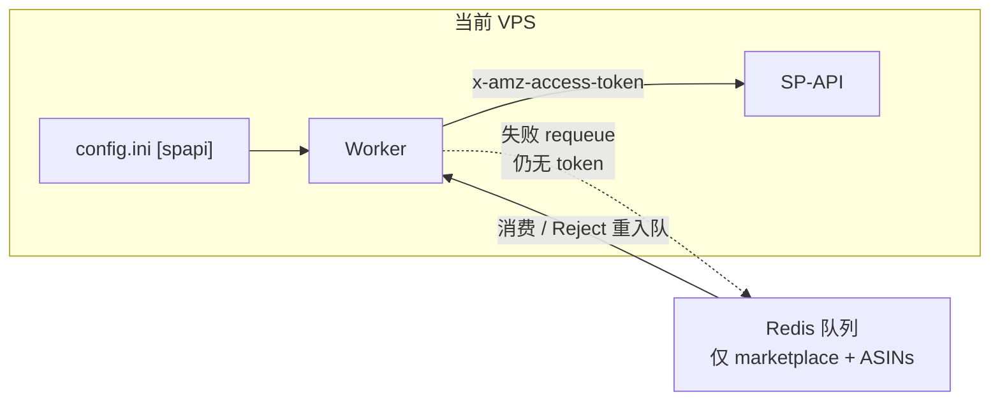
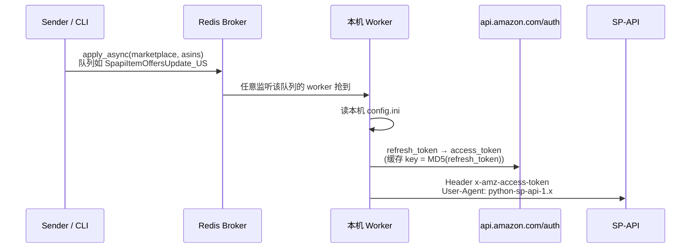
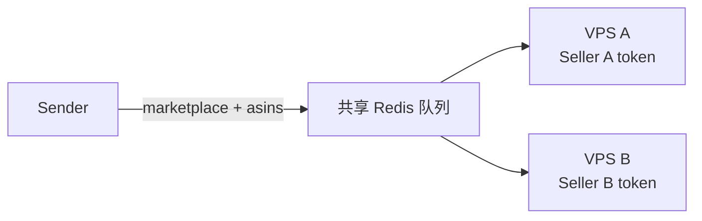

# SP-API 授权隔离：多 Worker / 多 VPS

本文说明本项目如何加载亚马逊授权、如何发 SP-API 请求，以及多台 VPS 协同时**授权混用**与**账号关联**的风险与运维边界。

相关文档：[SPAPI_CORE.md](./SPAPI_CORE.md)（认证与请求）、[SPAPI_RATE_LIMITING.md](./SPAPI_RATE_LIMITING.md)（限流）、[deploy/README.md](../deploy/README.md)（部署）

---

## 结论（先读）

| 问题 | 答案 |
|------|------|
| Redis / 任务参数里有没有 token？ | **没有**。任务只有 `marketplace` + ASINs |
| 发 SP-API 时用哪套授权？ | **仅本机** `~/.em_celery/config.ini`，运行时从不从队列取凭证 |
| 重试 `Reject(requeue=True)` 会不会带上授权？ | **不会**。重入队的是原消息（marketplace + ASINs），凭证不进 broker |
| 单台 VPS 上多个 prefork worker 会不会串授权？ | **不会**（同源 `config.ini`） |
| 多台 VPS、**不同** seller、共享同一队列名，会不会混用？ | **会**。谁抢到任务就用谁机器上的授权 |
| 隔离靠什么？ | **运维约定**：本机 `config.ini` 的 seller ≡ 本机监听队列应对应的 seller。代码不做账号亲和校验 |

---

## 设计不变量：本机授权 + 队列无凭证

这是当前实现的硬约束，不是可选约定：

1. **发请求只用当前 VPS 配置**  
   Worker 通过 `BaseTask.spapi` → `get_spapi()` 读取本机 `[spapi]`。任务函数签名与 sender 的 `apply_async(args=...)` 均不含 `refresh_token` / `lwa_client_*`。

2. **重试回队不携带授权**  
   Catalog / Offer 在 Forbidden 或可重试异常时：

   ```python
   raise Reject(str(e), requeue=True)
   ```

   Celery 把**同一条** broker 消息重新放回队列；消息体仍是入队时的 `(marketplace, asins, …)`。`Reject` 的 `str(e)` 仅作拒绝原因，不会把本机凭证写入 Redis。下一台（或本机）worker 消费时，再用**自己**磁盘上的 `config.ini` 换 token、发请求。



因此：**凭证从不离开本机；队列只调度工作单元。** 多 seller 时仍须用队列隔离避免「工作被别的 seller 的机器抢走」，那是亲和性问题，不是 token 随消息传递。

---

## 1. 授权从哪里来

每台机器只读本机磁盘上的配置，**没有**按任务选择账号的逻辑。

| 位置 | 内容 |
|------|------|
| `~/.em_celery/config.ini` → `[spapi]` | `lwa_refresh_token`、`lwa_client_id`、`lwa_client_secret` |
| `/etc/conf.d/em_celery` | `BROKER_URL`、队列名、并发 — **不含** SP-API 密钥 |

路径固定（`em_celery/paths.py`），无环境变量覆盖 config 路径。

```
~/.em_celery/config.ini  [spapi]
  lwa_refresh_token   → 某个 Seller 的长期授权
  lwa_client_id       → Developer App
  lwa_client_secret
        ↓
get_spapi()  → Spapi(credentials)     # em_celery/__init__.py
        ↓
BaseTask.spapi                         # 每个 worker 进程懒加载一次后复用
```

关键代码：

```python
# em_celery/__init__.py
def get_spapi():
  config = get_config()
  spapi_cfg = config['spapi']
  credentials = {
    'refresh_token': spapi_cfg['lwa_refresh_token'],
    'lwa_app_id': spapi_cfg['lwa_client_id'],
    'lwa_client_secret': spapi_cfg['lwa_client_secret'],
  }
  return Spapi(credentials)
```

Celery 任务签名只有 marketplace / asins / condition 等，**不含账号 ID、不含 token**。谁消费这条消息，就用谁机器上的 `config.ini`。

---

## 2. 发请求的完整流程



步骤：

1. Sender 把任务丢进按 **marketplace** 命名的队列（如 `SpapiItemOffersUpdate_US`），不带 seller 身份。
2. Worker 用本机 `refresh_token` 向 LWA（`POST https://api.amazon.com/auth/o2/token`）换 `access_token`（库内 TTL 缓存，约 53 分钟）。
3. 调 Pricing / Catalog API，请求头带 `x-amz-access-token`（非 AWS SigV4）。
4. 结果写入 Elasticsearch（与授权无关）。

认证细节见 [SPAPI_CORE.md §2](./SPAPI_CORE.md#2-认证与客户端创建)。

---

## 3. 共享状态与隔离边界

| 状态 | 作用域 | 跨账号混用风险 |
|------|--------|----------------|
| `em_celery._cfg` / `get_spapi()` | 进程全局 | 低：一进程读一份本机 INI |
| `BaseTask._spapi` | 类属性 / 每进程一次 | 低（一 credential）；热换 config 不重启会粘旧凭证 |
| `Spapi._sp_*_apis` | **类级** dict，按 marketplace | 见 §5 潜在坑 |
| SDK `AccessTokenClient` 缓存 | 模块级 TTLCache | 按 `MD5(refresh_token)`；不同 token 不碰撞 |
| Redis broker | 集群共享 | **不存 token**；共享队列会混合**工作** |
| Celery 任务参数 | broker 消息 | 仅 marketplace / asins — 无密钥 |
| ES 索引 | 通常共享 | 数据共享，不是授权混用 |

**隔离边界 = 本机文件系统上的 `[spapi]` + 本机订阅的队列集合。**  
不是 Redis，不是 Celery 参数，也不是运行时账号选择器。

---

## 4. 授权混用：什么时候会发生

| 场景 | 是否混用 | 说明 |
|------|----------|------|
| 一台 VPS、一个 `[spapi]`、本机多个 prefork worker | 否 | 同源 token，进程各自缓存 |
| 多台 VPS **同一** `refresh_token`，共享队列 | 否（身份一致） | 同一账号横向扩容 |
| 多台 VPS **不同** `refresh_token`，**共享同一 Redis + 同一队列名** | **是（高风险）** | 任务随机落到 A 或 B，Amazon 看到不同 seller 在拉同一批 ASIN |
| Forbidden / 限流后 `Reject(requeue=True)` | **加剧** | 消息回队，可能被另一台用另一套授权重试 |

当前部署模板（如 `deploy/mi01eu`）常指向 **共享 legacy Redis**，队列名全局统一（`SpapiItemOffersUpdate_US` 等）。代码层**没有** seller 亲和性、没有按账号过滤队列。



若 A、B 的 `lwa_refresh_token` 不同却都听同一队列：这不是 Redis 泄露密钥，而是**每次 HTTP 调用的 seller 身份不确定**。

---

## 5. 代码潜在坑：类级 API 客户端缓存

```python
# em_tasks/spapi/__init__.py
class Spapi():
  _sp_catalog_items_apis = dict()   # 类变量，仅按 marketplace 缓存
  _sp_products_apis = dict()
```

客户端按 **marketplace** 缓存在类上，**不按 credentials**。当前约定是「一进程一 credential」，没问题。若将来在同一进程里先后 `Spapi(credA)`、`Spapi(credB)`，后创建的会复用先创建的 API 客户端 → **进程内真·授权串用**。

---

## 6. 账号关联（不是 token 串了，是 Amazon 侧可关联）

即使每台 VPS 的 `refresh_token` 不同，下列信号仍可能让 Amazon 把多个 seller 关联成同一运营方：

1. **同一 Developer App**（多台复制同一套 `lwa_client_id` / `lwa_client_secret`）
2. **同一出口 IP / 同一机房 NAT**
3. **完全相同的 User-Agent**（库固定为 `python-sp-api-{version}`，项目未做区分）
4. **行为模式相似**：同一 Redis 调度、同一批 ASIN、相近 QPS、同一时间窗口
5. **同一 refresh_token 拷到多台**（扩容同一账号时合法，但与「多账号隔离」目标相反；限流按账号全局，见 [SPAPI_RATE_LIMITING.md](./SPAPI_RATE_LIMITING.md)）

项目代码内**没有**按账号的代理、UA 或 TLS 指纹隔离。

---

## 7. Telegram 侧信道：`deactivate()` 会发送原始 refresh_token

### 这句话是什么意思

「侧信道」= 授权凭证本应只留在本机 `config.ini` 和进程内存里，却通过**另一条非 SP-API 通道**（这里是 Telegram 告警）被发出去。

vendor 包装层在标记某 marketplace 不可用时，会把 **完整的 `refresh_token` 字符串** 写进 JSON，再经信号发到 Telegram：

```python
# vendor/dropshipping/dropshipping/spapi/decorators.py
def deactivate(self, marketplace_id, reason=''):
    ...
    payload = {
        'refresh_token': self.credentials.refresh_token,  # ← 原始长期令牌
        'marketplace': marketplace_id,
        'reason': reason
    }
    return sendRobust(signal=spapi_unavailable, message=json.dumps(payload))

# 模块加载时已连接：
dispatcher.connect(TelegramBot.send_message, signal=spapi_unavailable)
```

后果：

- `refresh_token` 出现在 Telegram 群消息里（聊天记录、设备、可能的 bot 日志、有群权限的人都能看到）。
- 拿到该字符串的人可配合同一 Developer App 的 client_id/secret 换 access_token，**冒充该 seller 调 SP-API**。
- 这与「Redis 不传 token」不矛盾：主路径安全，告警路径可能泄露。

### 与当前 Celery Forbidden 主路径的区别

本仓库 Celery 任务在 Forbidden 时**不走** `deactivate()`，只发 hostname，**不含 token**：

```python
# em_celery/tasks/spapi_update_item_offers_task.py（catalog 类似）
except (SellingApiForbiddenException, AuthorizationError) as e:
    ...
    self.bot.send_message(
      self.group_chat_id,
      "[SellingApiForbidden] Host: {}, API: GetItemOffersBatch\n".format(self.request.hostname)
    )
    raise Reject(str(e), requeue=True)
```

因此：**日常 Celery Catalog/Offer worker 遇到 403，一般不会把 refresh_token 打进 Telegram。**

但 `deactivate()` 仍存在于 vendored `dropshipping` 包中，且被旧路径（如 `price_finders`、`report_downloader` 等）在 Forbidden 时调用。只要进程 import 了该 wrapper 且触发了 `deactivate`，侧信道就会生效。

| 路径 | 是否发 refresh_token |
|------|----------------------|
| Celery `spapi_update_*` Forbidden → `self.bot.send_message(hostname…)` | 否 |
| vendor `*.deactivate()` → `spapi_unavailable` → Telegram | **是** |

运维建议：勿把生产 Telegram 群当作可公开频道；若需加固，应改 payload（只发 hostname / marketplace / 打码 token）或断开 `spapi_unavailable` → Telegram 的连接。

---

## 8. 多 Worker 协同：安全拓扑

**目标：一个 seller ↔ 一组队列 ↔ 一组只装该 seller 凭证的 VPS。**

任选其一（或组合）：

### 方案 A：队列 / Broker 隔离（多 seller 推荐）

- Seller A 的 VPS 只听专属队列（或独立 Redis DB），例如按账号命名的队列前缀。
- Sender 按账号路由入队。
- **禁止** 不同 seller 的机器订阅同一全局名 `SpapiItemOffersUpdate_US`。

### 方案 B：凭证一致扩容（单 seller 水平扩展）

- 多 VPS **必须** 使用 **同一个** `lwa_refresh_token`。
- 注意 Amazon 侧限流是全局的，本机 Celery `rate_limit` **不会**跨机聚合。

### 禁止

- 不同 seller 的 `config.ini` 装在不同机器上，却订阅同一共享队列。
- 把 A 的 config 拷到 B（或反过来），两边仍接同一 broker 队列集合。

### 运维自检

```bash
# 本机实际授权（勿把完整输出发到公开渠道）
grep -E '^lwa_' ~/.em_celery/config.ini

# 本机监听的队列与 Broker
grep -E 'CELERY_|BROKER_URL' /etc/conf.d/em_celery

# 与其它 VPS 人工对比：
# - refresh_token 是否相同（同 seller 扩容）还是不同（必须队列隔离）
# - 队列名是否重叠
# - BROKER_URL / Redis DB 是否同一共享空间
```

---

## 9. 证据索引

| 关注点 | 位置 |
|--------|------|
| 唯一凭证来源 | `em_celery/__init__.py` → `get_spapi()` |
| 配置路径固定 | `em_celery/paths.py` |
| 任务无账号字段 | `spapi_update_item_offers` / catalog 同类；sender `apply_async` |
| 进程内 Spapi 缓存 | `em_celery/tasks/base.py` |
| 类级 marketplace 客户端缓存 | `em_tasks/spapi/__init__.py` |
| LWA + token 缓存 | SDK `AccessTokenClient`；[SPAPI_CORE.md](./SPAPI_CORE.md) |
| Forbidden 主路径告警（无 token） | `em_celery/tasks/spapi_update_*_task.py` |
| `deactivate` 把 refresh_token 发 Telegram | `vendor/dropshipping/.../spapi/decorators.py` |
| 共享 broker 部署 | `deploy/mi01eu/`、`deploy/README.md` |
| Requeue 任意 worker | Layer 3 `Reject(requeue=True)`；[SPAPI_RATE_LIMITING.md](./SPAPI_RATE_LIMITING.md) |

---

## 10. 一句话

本仓库不会在 Redis / 任务参数里传授权，单机内也不会「选错账号」；**混用**发生在「多机共享队列 + 各机不同 refresh_token」。**账号关联**主要来自同 App、同 IP、同 UA、同调度行为。Telegram 侧信道是另一条泄露面：vendor `deactivate()` 可能把原始 refresh_token 打进群消息，而当前 Celery Forbidden 主路径不会。
