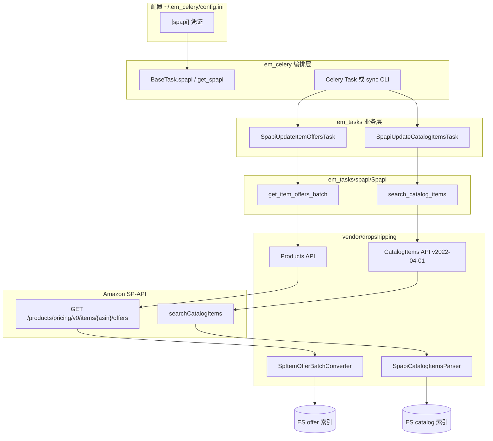
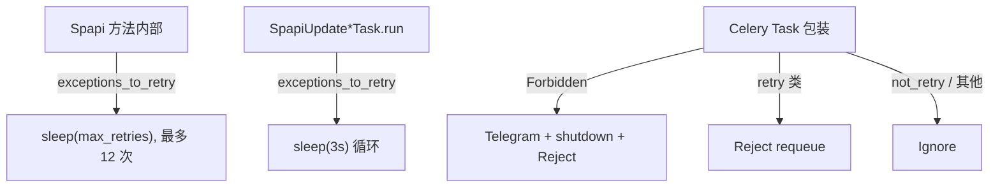

# SP-API 核心：如何发起请求与返回结果

本文从**核心功能**讲起，说明本项目如何调用 Amazon SP-API、请求参数是什么、原始响应如何被转换、最终写入 ES 的数据长什么样。适合在读完 [ENTRY_POINTS.md](./ENTRY_POINTS.md) 后深入理解业务层。

相关文档：[OFFER_PIPELINE.md](./OFFER_PIPELINE.md)、[SYNC_FETCH_OFFERS.md](./SYNC_FETCH_OFFERS.md)

---

## 1. 调用栈总览



| 层级 | 目录 / 类 | 职责 |
|------|-----------|------|
| 凭证 | `em_celery/__init__.py` → `get_spapi()` | 从 config 组装 credentials |
| 客户端 | `em_tasks/spapi/Spapi` | 封装两个 API、重试、marketplace 映射 |
| 底层 SDK | `vendor/dropshipping/spapi` | 对 `python-amazon-sp-api` 的 wrapper |
| 转换 | `offer_converters.py`、`spapi_catalog_items_parser.py` | 原始 JSON → 项目内部结构 |
| 持久化 | `EsOfferService`、`ProductService` | 写入 Elasticsearch |

---

## 2. 认证与客户端创建

### 2.1 配置段 `[spapi]`

```ini
[spapi]
lwa_refresh_token = ...
lwa_client_id = ...
lwa_client_secret = ...
aws_access_key = ...
aws_secret_key = ...
```

### 2.2 组装 credentials

Worker 路径（`em_celery/tasks/base.py`）：

```python
credentials = {
    'refresh_token': spapi_cfg['lwa_refresh_token'],
    'lwa_app_id': spapi_cfg['lwa_client_id'],
    'lwa_client_secret': spapi_cfg['lwa_client_secret'],
    'aws_access_key': spapi_cfg['aws_access_key'],
    'aws_secret_key': spapi_cfg['aws_secret_key'],
}
self._spapi = Spapi(credentials)
```

同步脚本路径（`get_spapi()` in `em_celery/__init__.py`）使用相同字段。

### 2.3 API 客户端缓存

`Spapi` 按 marketplace **懒加载并缓存**两类客户端：

| 方法 | 底层类 | API 版本 |
|------|--------|----------|
| `get_products_api(marketplace)` | `dropshipping.spapi.Products` | Products Pricing v0 |
| `get_catalog_items_api(marketplace)` | `dropshipping.spapi.CatalogItems` | **2022-04-01** |

marketplace 必须是 `base.Marketplaces` 中已知的代码（如 `US`、`UK`、`CA`），否则 `ValueError`。

---

## 3. Marketplace 映射

**文件：** `em_tasks/spapi/__init__.py`

### 3.1 Marketplace ID

内部用小写 marketplace 代码（如 `us`），请求 Amazon 时转为 **MarketplaceId**：

| 代码 | MarketplaceId | 区域 |
|------|---------------|------|
| US | ATVPDKIKX0DER | NA |
| CA | A2EUQ1WTGCTBG2 | NA |
| UK | A1F83G8C2ARO7P | EU |
| DE | A1PA6795UKMFR9 | EU |
| ES | A1RKKUPIHCS9HS | EU |
| … | （共 22 个） | … |

完整列表见 `marketplaceIdList` / `marketplaceRegions`。

### 3.2 Locale（Catalog 专用）

`get_locale(marketplace)` 为 Catalog 搜索选择 locale，例如：

- US / JP → `en_US`
- UK / DE / BE → `en_GB`
- ES → `es_ES`
- CA → `en_CA`

---

## 4. Offer 请求：`get_item_offers_batch`

**入口：** `Spapi.get_item_offers_batch(marketplace, asins, condition='New')`  
**业务调用方：** `SpapiUpdateItemOffersTask.run()`  
**Amazon API：** Product Pricing — batch get item offers

### 4.1 请求如何构造

对每个 ASIN 生成一条 batch 子请求：

```python
requests = [
    {
        'uri': '/products/pricing/v0/items/{asin}/offers',
        'method': 'GET',
        'MarketplaceId': marketplace_id,   # 如 ATVPDKIKX0DER
        'ItemCondition': condition,        # 如 New / new
    }
    for asin in asins
]
responses = sp_products_api.get_item_offers_batch(requests)
```

约束：

- 每批 ASIN 数量：**最多 20**（Sender / Celery task / sync CLI 均按 20 切分）
- `condition` 传入 task 时为 `new` 等小写；SP-API 侧按 `ItemCondition` 字段发送

### 4.2 原始响应结构（概念）

`get_item_offers_batch` 返回的 payload 大致为：

```json
{
  "responses": [
    {
      "request": { "Asin": "B0XXXX", "MarketplaceId": "...", "ItemCondition": "New" },
      "body": {
        "payload": {
          "ASIN": "B0XXXX",
          "Summary": { ... },
          "Offers": [
            {
              "ListingPrice": { "Amount": 9.99, "CurrencyCode": "USD" },
              "Shipping": { "Amount": 0.0, "CurrencyCode": "USD" },
              "SubCondition": "new",
              "SellerId": "...",
              "IsBuyBoxWinner": true,
              "IsFulfilledByAmazon": true,
              ...
            }
          ]
        }
      }
    }
  ]
}
```

若某个 ASIN 无效，`body.errors` 会有错误详情而非 `payload`。

### 4.3 转换：`SpItemOfferBatchConverter`

**文件：** `vendor/dropshipping/dropshipping/utils/offer_converters.py`

遍历 `responses`，输出 **dict[asin → item_offer]**：

```python
{
  "B0XXXX": {
    "asin": "B0XXXX",
    "offers": [ { ... 标准化 offer 对象 ... }, ... ],
    "summary": "",           # batch 路径当前写空字符串
    "time": "2026-07-08T21:00:00"
  }
}
```

每个 offer 对象字段（`type: "SpItemOffer"`）：

| 字段 | 含义 |
|------|------|
| `asin`, `country`, `condition`, `subcondition` | 标识 |
| `product_price`, `shipping_price`, `price` | 商品价格、运费、落地价（四舍五入） |
| `currency` | 货币代码 |
| `shipping_time` | `{min, max}` 天数、`availability_type` |
| `rating`, `feedback` | 卖家好评率、反馈数 |
| `domestic`, `ships_from` | 是否本国发货 |
| `fba` | 是否 FBA |
| `is_buybox_winner`, `is_featured_merchant` | Buy Box / Featured |
| `seller_id`, `prime_information`, `condition_notes` | 卖家与 Prime 信息 |

错误 ASIN 处理：

- `body.errors` 存在 → `offers: []`，附带 `errors` 字段，并触发 `invalid_asin` 信号
- 无法解析 marketplace/condition → 空 offers + `errors`

### 4.4 补全缺失 ASIN

若 `add_default_offer=True`（默认），请求中有但响应里**没有**的 ASIN 会补：

```python
{'asin': asin, 'offers': [], 'summary': '', 'time': now}
```

### 4.5 写入 ES

`EsOfferService.save_item_offers('lowest_offer_listings', offers, marketplace, condition)`：

- 索引：`lowest_offer_listings_{marketplace}_{condition}`（非 `new` 时 condition 归一为 `any`）
- 文档 `_id` = ASIN
- `_source.offers` / `_source.summary` 为 **JSON 字符串**
- `_source.time` = 写入时刻 UTC

---

## 5. Catalog 请求：`search_catalog_items`

**入口：** `Spapi.search_catalog_items(asins, marketplace)`  
**业务调用方：** `SpapiUpdateCatalogItemsTask.search_catalog_items()`  
**Amazon API：** Catalog Items **searchCatalogItems**（2022-04-01）

### 5.1 请求参数

```python
params = {
    'marketplaceIds': [market_id],
    'includedData': 'summaries,attributes,dimensions,identifiers,images,productTypes,relationships,salesRanks,classifications',
    'locale': locale,                    # 按 marketplace 选择
    'identifiers': ','.join(asins),      # 最多 20 个 ASIN
    'identifiersType': 'ASIN',
}
items = catalog_api.search_catalog_items(**params)
```

也支持 `search_type='keywords'` 时用 `keywords` 而非 `identifiers`（本项目 task 默认 identifiers）。

### 5.2 原始响应

`response.payload` 含 `items` 数组，每个 item 含：

- `asin`
- `summaries`, `attributes`, `dimensions`, `images`, `salesRanks`, `classifications`, …

若单条有 `Error` 字段，parser 会打日志并跳过。

### 5.3 转换：`SpapiCatalogItemsParser.parse()`

**文件：** `em_tasks/spapi/spapi_catalog_items_parser.py`

输出 **dict[asin → product_doc]**，主要字段：

| 字段 | 来源 |
|------|------|
| `asin`, `title`, `brand` | attributes / summaries |
| `weight`, `lwh` | dimensions 换算（pint 单位库） |
| `sales_rank`, `sales_ranks` | salesRanks |
| `top_category`, `second_category`, `third_category`, `categories` | classifications 树 |
| `images` | 图片 URL 列表 |
| `item_dimensions`, `item_package_weight`, … | attributes 扩展 |
| 原始块 | `summaries`, `attributes`, `dimensions` 等保留 |

### 5.4 写入 ES

`SpapiUpdateCatalogItemsTask.run()`：

1. `ProductService.save_products('amz_products_api_{mp}_v2', docs)`
2. 请求了但 API 未返回的 ASIN → `amz_products_missing_{mp}`

---

## 6. 重试与异常

### 6.1 异常分类

**文件：** `em_tasks/spapi/__init__.py`

```python
exceptions_to_retry = (
    SellingApiRequestThrottledException,      # 429 限流
    SellingApiServerException,                # 5xx
    SellingApiTemporarilyUnavailableException,
    SellingApiStateConflictException,
)

exceptions_not_retry = (
    SellingApiNotFoundException,
    SellingApiForbiddenException,             # 403 权限
    SellingApiTooLargeException,
    SellingApiUnsupportedFormatException,
)
```

### 6.2 三层重试



| 层级 | 位置 | 行为 |
|------|------|------|
| Layer 1 | `Spapi.search_catalog_items` / `get_item_offers_batch` | 最多 12 次，sleep 递减 |
| Layer 2 | `SpapiUpdateItemOffersTask` / `SpapiUpdateCatalogItemsTask` | `exceptions_to_retry` → sleep 3s 再调 Layer 1 |
| Layer 3 | `em_celery/tasks/spapi_update_*_task.py` | Celery `Reject` / `Ignore`、Telegram |

特殊：

- `SellingApiBadRequestException` 且 message 含 `invalid ASIN` → `SellingApiInvalidAsinException`
- `SellingApiForbiddenException` → Layer 1 sleep 3s（catalog）或 7s（offer）后抛出

---

## 7. 端到端示例（Offer）

```
1. Celery 收到 task: marketplace=us, asins=[B0A, B0B], condition=new

2. SpapiUpdateItemOffersTask.run()
   └─ spapi.get_item_offers_batch('us', ['B0A','B0B'], 'new')

3. Spapi 构造 2 条 batch GET → Products.get_item_offers_batch

4. SpItemOfferBatchConverter.convert(responses)
   └─ {
        'B0A': { asin, offers: [...], summary: '', time },
        'B0B': { asin, offers: [], summary: '', time },
      }

5. EsOfferService.save_item_offers(...)
   └─ bulk index → lowest_offer_listings_us_new
```

同步脚本 `spapi_fetch_item_offers_sync` 在第 2–5 步与 Worker **完全相同**，只是不经过 Celery。

---

## 8. 端到端示例（Catalog）

```
1. task: marketplace=de, asins=[B0C, ...]  (≤20)

2. SpapiUpdateCatalogItemsTask.run()
   └─ spapi.search_catalog_items(asins, marketplace='de')

3. CatalogItems.search_catalog_items(marketplaceIds, identifiers, includedData, locale)

4. SpapiCatalogItemsParser.parse(response)
   └─ { 'B0C': { asin, title, brand, weight, categories, ... } }

5. ProductService.save_products('amz_products_api_de_v2', [...])
   缺失 ASIN → amz_products_missing_de
```

---

## 9. 代码索引

| 主题 | 文件 |
|------|------|
| SP-API 封装 | `em_tasks/spapi/__init__.py` |
| Catalog 解析 | `em_tasks/spapi/spapi_catalog_items_parser.py` |
| Offer 转换 | `vendor/dropshipping/dropshipping/utils/offer_converters.py` |
| 底层 SDK wrapper | `vendor/dropshipping/dropshipping/spapi/` |
| Offer 业务 task | `em_tasks/tasks/spapi_update_item_offers_task.py` |
| Catalog 业务 task | `em_tasks/tasks/spapi_update_catalog_items_task.py` |
| Celery 包装 + 凭证 | `em_celery/tasks/base.py`、`em_celery/tasks/spapi_update_*_task.py` |
| 同步 CLI | `em_celery/tools/spapi_fetch_item_offers_sync.py` |
| Offer 写 ES | `vendor/dropshipping/dropshipping/utils/offer_services.py` |
| Catalog 写 ES | `em_tasks/utils/product_service.py` |

---

## 10. 常见问题

**Q：Offer 和 Catalog 用的是同一个 `Spapi` 实例吗？**  
A：是。每个 Worker 进程内 `BaseTask.spapi` 懒加载一个 `Spapi`，按 marketplace 缓存 Products / CatalogItems 客户端。

**Q：`condition=new` 和 SP-API 的 `ItemCondition=New` 关系？**  
A：task 层传小写 `new`；batch 请求里作为 `ItemCondition` 原样带给 API；写 ES 时索引名为 `lowest_offer_listings_{mp}_new`。

**Q：为什么 batch offer 的 `summary` 是空字符串？**  
A：`SpItemOfferBatchConverter` 里故意注释掉了 `payload.get('Summary')`，当前只持久化 `offers` 列表。

**Q：如何本地只测 SP-API 不写 Celery？**  
A：`spapi_fetch_item_offers_sync -m us -a B0XXX`，见 [SYNC_FETCH_OFFERS.md](./SYNC_FETCH_OFFERS.md)。

**Q：Rate limit 是多少？**  
A：Celery task 注解：`spapi_update_item_offers` **8/m**，`spapi_update_catalog_items` **1/s**（均为**每个 Worker 子进程**独立计数）。Amazon 429 由 Layer 1–3 重试处理。多进程/多机如何叠加、是否全局协调，见 [SPAPI_RATE_LIMITING.md](./SPAPI_RATE_LIMITING.md)。
