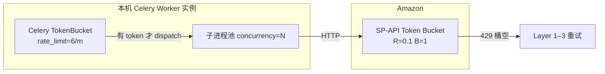
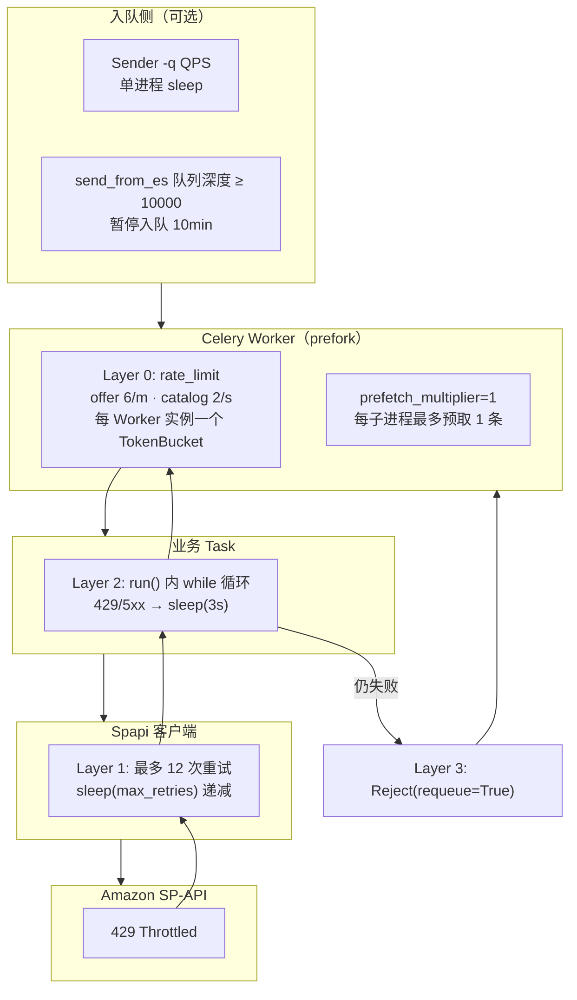
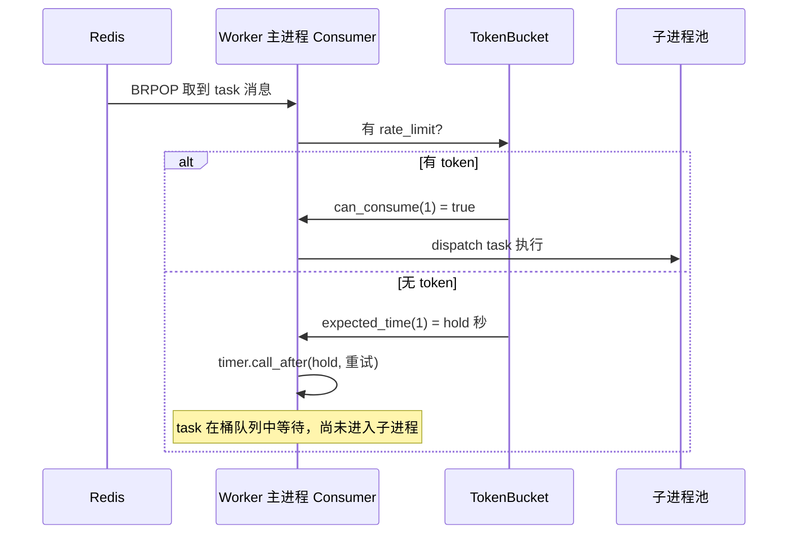
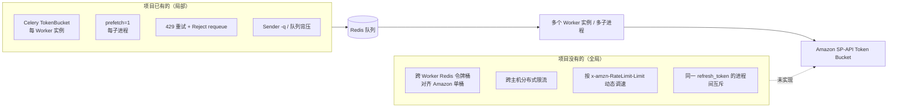
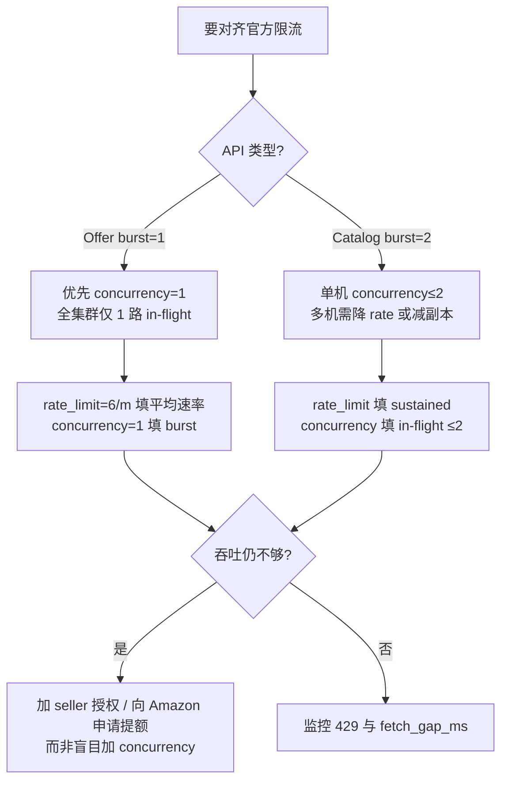

# SP-API 限流与 Celery 多进程协调

本文说明本项目如何应对 Amazon SP-API 限流（429）、Celery **prefork 多进程**下各进程如何（以及**如何不**）协调请求速率，以及运维侧应如何调参。

相关文档：[SPAPI_CORE.md](./SPAPI_CORE.md)、[OFFER_PIPELINE.md](./OFFER_PIPELINE.md)、[PRIORITY_QUEUE.md](./PRIORITY_QUEUE.md)

---

## 1. 问题背景

### 1.1 Amazon 侧限流

SP-API 对每个 **Developer App + Seller 凭证 + API 操作** 有 Usage Plan（速率 + 突发）。超出配额时返回 **HTTP 429**，SDK 映射为 `SellingApiRequestThrottledException`。

本项目主要涉及：

| API | Task | 每次 task 的 HTTP 调用 |
|-----|------|------------------------|
| Products `getItemOffersBatch` | `spapi_update_item_offers` | **1 次** batch（最多 20 ASIN） |
| Catalog `searchCatalogItems` | `spapi_update_catalog_items` | **1 次**（最多 20 ASIN） |

Amazon 的配额是**全局**的：同一套 `[spapi]` 凭证下，所有 Worker 进程、所有主机、同步脚本 `spapi_fetch_item_offers_sync` 的请求**加在一起**都计入同一 Usage Plan。

### 1.3 Amazon 官方限流模型（Token Bucket）

官方文档：[Usage Plans and Rate Limits](https://developer-docs.amazon.com/sp-api/docs/usage-plans-and-rate-limits)

SP-API 使用**令牌桶**：

| 概念 | 含义 |
|------|------|
| **Rate** | 每秒向桶中补充的 token 数（持续调用应低于此值） |
| **Burst** | 桶容量上限；最多可「攒」下这么多 token 后瞬时发出 |
| **一次 HTTP 调用** | 消耗 1 个 token |
| **429** | 桶空时仍发起请求 |

要点：

1. **按「Selling Partner + Application」配对**计桶（同一 `[spapi]` refresh_token + 同一 Developer App 共享配额）。
2. **同一 operation 独立一桶**（`getItemOffersBatch` 与 `searchCatalogItems` 互不影响）。
3. **多维度同时生效，先到先限**：例如 Catalog 同时有 per account-application 与 per application 上限，**先触达的那条**生效。
4. **Marketplace 不拆桶**：同一 seller 账号下不同站点通常仍共享 account-application 配额（桶按授权身份划分，而非按队列名 `SpapiItemOffersUpdate_US` 划分）。
5. **`x-amzn-RateLimit-Limit` 响应头**（20x/400/404 时可能有）：表示 **account-application pair** 下该 operation 的 rate（req/s）。**不能依赖其一定存在**；且**不含** per-application 等其他 plan 的信息。
6. 官方建议 429 时 **指数退避 + jitter**、**均匀分布请求**、**不要 hardcode 固定 sleep**；仍可能偶发 429，应用必须能处理。

官方优化指南：[Optimize Calls to the Selling Partner API](https://developer-docs.amazon.com/sp-api/docs/optimize-calls-to-the-selling-partner-api)

### 1.4 本项目 API 的官方默认配额

以下为 **API Reference / Changelog 公布的默认值**；个别 seller 可能被 Amazon 调高（仍可通过响应头确认）。**以你账号实际返回的 `x-amzn-RateLimit-Limit` 为准。**

#### Product Pricing — `getItemOffersBatch`

| 项 | 默认值 | 来源 |
|----|--------|------|
| Rate | **0.1 req/s**（持续） | [2023-07 下调公告](https://github.com/amzn/selling-partner-api-models/discussions/3595)（由 0.5 降至 0.1） |
| Burst | **1** | 同上 / [Product Pricing 限流调整](https://developer-docs.amazon.com/sp-api/changelog/sp-api-throttling-adjustments) |
| 每请求 ASIN 数 | 1–20 | [getItemOffersBatch Reference](https://developer-docs.amazon.com/sp-api/reference/getitemoffersbatch) |
| 持续吞吐换算 | **6 batch 请求/min** | 0.1 × 60 |

> 2022 年 changelog 中 batch 曾为 0.5 req/s；2023 年 7 月起默认 **0.1 req/s**。若长期未再变更，文档与线上默认值以 Reference + 响应头为准。

#### Catalog Items v2022-04-01 — `searchCatalogItems`（identifier / ASIN）

本项目使用 **identifiers + identifiersType=ASIN**（非 keyword 搜索）。

| 维度 | Rate | Burst | 来源 |
|------|------|-------|------|
| per **account-application pair** | **2 req/s** | **2** | [Catalog Items API Rate Limits](https://developer-docs.amazon.com/sp-api/docs/catalog-items-api-rate-limits) |
| per **application**（全局） | 500 req/s | — | 同上；identifier 搜索适用 |
| keyword 搜索（本项目不用） | 50 req/s per application | — | 同上 |

持续吞吐：account-application 维度约 **120 req/min**；burst=2 表示桶满时最多连续 **2 次**不节流。

#### 与本项目 Celery task 的对应关系

| 官方 operation | 本项目 1 条 Celery task | HTTP 次数 |
|----------------|-------------------------|-----------|
| `getItemOffersBatch` | `spapi_update_item_offers` | 1 |
| `searchCatalogItems` | `spapi_update_catalog_items` | 1 |

因此对齐官方限流时，应控制 **集群内 batch HTTP 请求速率**，而不是 ASIN 条数（batch 内 20 ASIN 仍算 1 token）。

### 1.5 Celery 官方模型

Celery Worker 默认使用 **prefork** 池：`--concurrency N` 会 fork **N 个子进程** 执行 task；**从 Redis 取消息、限速** 发生在 Worker **主进程的 Consumer** 里，不在子进程。

官方建议对 I/O 密集型 task 配合 **task 级 `rate_limit`**，避免打满下游。

**重要：** Celery 的 `rate_limit` 是 **每个 Worker 实例**（一次 `celery worker` 命令）共享 **一个** TokenBucket，**不是**每个子进程各一桶，也 **不是** 跨主机全局限速。详见 §3 与 [Celery Task.rate_limit](https://docs.celeryq.dev/en/stable/userguide/tasks.html#Task.rate_limit)。

### 1.6 两套 Token Bucket：概念一致，桶不是同一个

Celery Layer 0 与 Amazon SP-API 都使用 **Token Bucket（令牌桶）** 算法，但它们是 **不同层、不同作用域** 的两套桶：

| 对比项 | Celery `rate_limit`（Layer 0） | Amazon SP-API（服务端） |
|--------|-------------------------------|-------------------------|
| **算法** | Token Bucket（Kombu `TokenBucket`） | Token Bucket（官方 Usage Plan） |
| **位置** | Worker 主进程 Consumer 内 | Amazon 网关 / 配额服务 |
| **作用** | 控制 task **何时开始执行**（本地节流） | 控制 HTTP **是否接受**（429 拒绝） |
| **协调范围** | **单 Worker 实例** | **全局**（同一 refresh_token + app + operation） |
| **Rate** | `6/m` → fill_rate = 0.1 token/s | Offer 默认 0.1 req/s；Catalog 默认 2 req/s |
| **Burst / capacity** | Celery **固定 capacity=1** | Offer burst=1；Catalog burst=2 |
| **桶空时** | `timer.call_after(hold)` **等待**，推迟启动 task | 返回 **HTTP 429**，客户端退避重试 |
| **均匀分布** | 官方：token 匀速补充，task 在时间段内 **均匀启动** | 官方：建议均匀发请求，避免瞬时打满 |
| **与 Sender 关系** | **无关**；读 task 装饰器上的 `rate_limit` | **无关**；所有 HTTP 消费者共享 |



**结论：**

1. **算法家族一致**（都是 token bucket），所以用 `rate_limit=6/m` 对齐 `0.1 req/s` 是合理思路。
2. **不是同一个桶**——Celery 桶只在本地 Worker 内生效；多台 Worker、同步脚本、其他服务 **不消耗** Celery 的 token，但仍 **消耗** Amazon 的 token。
3. **`concurrency` 管并行执行，不乘在 `rate_limit` 上**——`6/m` 是整台 Worker 每分钟最多 **启动** 6 次 task；`concurrency=4` 只表示最多 4 个 task **同时跑**，若 task 耗时长，仍可能出现多路 in-flight HTTP（与 Amazon **burst** 相关）。

### 1.7 当前配置 vs 官方默认（差距一览）

假设 **1 个 seller 凭证 + 1 个 app**，推荐 `CELERY_OFFER_CONCURRENCY=1`、`CELERY_CATALOG_CONCURRENCY=2`，单机部署：

| API | 官方持续上限 | 本项目 Layer 0（单机 1 实例） | 是否对齐 |
|-----|-------------|------------------------------|----------|
| Offer batch | **6/min**（0.1/s） | rate_limit **6/m** → **6/min 启动** | **是** |
| Offer burst | **1** 并发 token | concurrency=**1** → in-flight ≤ 1 | **是** |
| Catalog | **2/s**（120/min） | rate_limit **2/s** → **2/s 启动** | **是** |
| Catalog burst | **2** | concurrency=**2** → in-flight ≤ 2 | **是**（单机） |

---

## 2. 本项目的限流架构（四层）



| 层级 | 位置 | 触发条件 | 行为 | 协调范围 |
|------|------|----------|------|----------|
| **入队 QPS** | `*_task_sender.py`、`-q` | 手动指定 QPS | `sleep(1/qps - elapsed)` | **仅该 Sender 进程** |
| **队列背压** | `*_send_from_es.py` | 队列深度 ≥ 10000 | `sleep(600)` 暂停入队 | 按 Redis 队列名，**不入队**而非限速消费 |
| **Layer 0** | `@app.task(rate_limit=...)` | Worker 实例内 token 耗尽 | Consumer 用 timer **延迟 dispatch** 下一条 task | **每个 Worker 实例**（主进程 Consumer） |
| **Layer 1** | `em_tasks/spapi/__init__.py` | 429 / 5xx / 暂时不可用 | `sleep(max_retries)`，最多 12 次 | **该 task 所在子进程** |
| **Layer 2** | `SpapiUpdate*Task.run()` | Layer 1 仍抛 `exceptions_to_retry` | `sleep(3)` 后重试整个 API 调用 | **该 task 所在子进程** |
| **Layer 3** | `em_celery/tasks/spapi_update_*_task.py` | Layer 2 仍失败 | `Reject(requeue=True)` 消息回队列 | 重新排队，**任意** Worker 可再次消费 |

---

## 3. Celery `rate_limit` 实现机制

### 3.1 Worker 如何知道限速？（不读 Sender）

限速值来自 **task 装饰器**，Worker 启动注册 task 时读取；Sender 的 `apply_async()` **不传** rate_limit。

```python
# em_celery/tasks/spapi_update_item_offers_task.py
@app.task(..., rate_limit='6/m')

# em_celery/tasks/spapi_update_catalog_items_task.py
@app.task(..., rate_limit='2/s')
```

含义（[Celery 官方](https://docs.celeryq.dev/en/stable/userguide/tasks.html#Task.rate_limit)）：

- **`6/m`**：该 **Worker 实例** 每分钟最多 **开始执行** 6 次此 task（≈ 每 10s 启动 1 次）
- **`2/s`**：该 Worker 实例每秒最多 **开始执行** 2 次此 task（对齐 account-application 2 req/s）
- 限速的是 **task 启动**，不是 Sender 入队速度

### 3.2 Token Bucket 内部实现（Celery 5.x 源码）

实现位于 Worker **主进程** Consumer（非 fork 子进程）：

| 组件 | 位置 | 作用 |
|------|------|------|
| `rate('6/m')` | `celery/utils/time.py` | 解析为 fill_rate：`6/60 = 0.1` token/s |
| `TokenBucket(fill_rate, capacity=1)` | `kombu/utils/limits.py` | 令牌桶；**capacity 固定为 1** |
| `task_buckets[task_name]` | `celery/worker/consumer/consumer.py` | 每个 task 名一个桶 |
| `task_message_handler` | `celery/worker/strategy.py` | 收到消息后检查桶 |
| `_limit_task` / `_schedule_bucket_request` | `consumer.py` | 无 token 则等待 |

**消息到达后的流程：**



**均匀分布如何实现：**

Celery 文档说明：token 在时间段内 **匀速补充**（非「攒够 N 个再突发」）。例如 `6/m`：

- fill_rate = 0.1 token/s → 平均 **每 10s 释放 1 个启动名额**
- capacity = 1 → 同一时刻最多 **预放行 1 个** task 启动
- 无 token 时：`expected_time()` 计算等待秒数，`timer.call_after(hold, ...)` 到期后再试

这与 SP-API 服务端桶的 **rate + burst** 思想类似，但 Celery **写死 capacity=1**，且只在 **单 Worker 实例** 内生效。

### 3.3 与 `concurrency` 的关系（易混淆）

| 配置 | 控制对象 | 与 SP-API 对应 |
|------|----------|----------------|
| `rate_limit` | 单位时间内 **启动** 多少 task | 对齐 **Rate**（持续 req/s） |
| `concurrency` | 最多 **同时执行** 多少 task | 对齐 **Burst / in-flight** |

二者 **不相乘**。示例（单 Worker 实例）：

```
rate_limit=6/m, concurrency=4

  启动速率：整台 Worker 合计 6 次/min（不是 6×4）
  同时执行：最多 4 个 task 并行（若单个 task 耗时长，可出现多路 HTTP in-flight）
```

因此 Offer 要对齐 Amazon **burst=1**，应 **`concurrency=1`**；仅调 `rate_limit` 无法保证同一时刻只有 1 路 HTTP。

### 3.4 多 Worker 实例如何叠加

**每个 Worker 实例各自一个 TokenBucket**，彼此不共享：

```
2 台 offer worker，各 rate_limit=6/m：

  Worker-A  →  6 task/min 启动
  Worker-B  →  6 task/min 启动
  ─────────────────────────────
  集群合计  →  12 次 batch HTTP/min  →  超过 Amazon 默认 6/min
```

公式（持续速率）：

```
集群 task 启动速率  ≈  Σ(每台 Worker 实例的 rate_limit)

Offer 对齐 0.1 req/s：
  N_workers × (rate_limit_per_min / 60)  ≤  0.1
  ⇒  rate_limit_per_min  ≤  6 / N_workers
```

**in-flight / burst（与 concurrency 相关）：**

```
集群 in-flight HTTP（同一 operation）≈  Σ(每台 Worker 的 concurrency)
Offer：应 ≤ 1（Amazon burst=1）
Catalog：单机可 ≤ 2（Amazon burst=2）；多机叠加需减小
```

项目内 **没有** Redis/DB 全局 TokenBucket 对齐 Amazon 配额；Layer 1–3 的 429 重试是 **Amazon 桶空** 后的被动处理。

### 3.5 与 Celery 官方建议及本项目配置

| 官方建议 | 本项目做法 |
|----------|------------|
| I/O 型 task 配合 `rate_limit` | offer `6/m`、catalog `2/s` |
| 限速为 **per worker instance** | 见 §3.4，多机需反算 |
| 避免 prefetch 过多 | `worker_prefetch_multiplier = 1` |
| 全局限速需额外机制 | **未实现**；靠减 Worker 副本 + 429 重试 |

`worker_prefetch_multiplier=1`（`em_celery/config.py`）保证每个子进程最多预取 1 条未 ACK 消息；**不等于** SP-API 全局限速。

### 3.6 其他 Worker 配置

| 配置 | 值 | 与限流关系 |
|------|-----|------------|
| `task_acks_late=True` | 执行成功才 ACK | 失败可 requeue，不丢消息 |
| `task_reject_on_worker_lost=True` | Worker 崩溃时 requeue | 避免 silent drop |
| `acks_late` + `Reject(requeue=True)` | 429 耗尽重试后 | task 回到 Redis，可能再次被任意 Worker 消费 |

生产并发来自 `/etc/conf.d/em_celery`（见 `deploy/conf.d/em_celery.example`）：

```bash
CELERY_CATALOG_CONCURRENCY=2   # catalog 子进程并行上限
CELERY_OFFER_CONCURRENCY=1     # offer 与 burst=1 对齐
```

本地开发 `local_dev/run_local_worker.sh` 固定 **`--concurrency 1`**。

---

## 4. 各层重试细节

### 4.1 Layer 1：`Spapi` 内部

**文件：** `em_tasks/spapi/__init__.py`

```python
max_retries = 12
while max_retries > 0:
    try:
        # get_item_offers_batch / search_catalog_items
        break
    except exceptions_to_retry:
        time.sleep(max_retries)   # 首次 sleep 12s，随后 11s、10s … 1s
        max_retries -= 1
```

`exceptions_to_retry` 含：`SellingApiRequestThrottledException`（429）、5xx、暂时不可用、状态冲突。

403 Forbidden 在抛出前额外 sleep（catalog 3s，offer 7s），然后进入 Celery Layer 3。

### 4.2 Layer 2：业务 Task

**Offer**（`em_tasks/tasks/spapi_update_item_offers_task.py`）：

```python
while True:
    try:
        offers = self.spapi.get_item_offers_batch(...)
        break
    except exceptions_to_retry:
        time.sleep(3)
```

**Catalog**（`em_tasks/tasks/spapi_update_catalog_items_task.py`）同理。

注意：`SpapiUpdateItemOffersTask._last_task_finish_ts` 是**类变量**，仅用于统计 `fetch_gap_ms` 写入 ES，**不参与限速**；fork 后每个子进程有独立副本。

### 4.3 Layer 3：Celery 包装

**Offer** 在 `exceptions_to_retry` 时：

```python
raise Reject(str(e), requeue=True)
```

并维护 `rejected_tasks_cnt`：累计超过 250 次发 Telegram `[SpapiItemOffersRejectedReset]`。

**Catalog** 同样 `Reject(requeue=True)`，无 250 次告警计数。

403 / `AuthorizationError`：Telegram + `app.control.broadcast('shutdown')` 关闭**当前 host 的 worker** + requeue。

---

## 5. 入队侧（Sender）速率控制

Sender **只负责往 Redis 塞 task**，不直接调 SP-API；但若入队过快，会堆高队列、让多进程同时消费，间接放大 429。

### 5.1 可选 QPS（`-q`）

**文件：** `em_celery/tools/spapi_update_item_offers_task_sender.py` 等

```python
if self.last_send_time:
    wait_time = 1 / self.qps - (time.time() - self.last_send_time)
    if wait_time > 0:
        time.sleep(wait_time)
```

- 仅当 CLI 传入 `-q/--qps` 时生效
- **单 Sender 进程**内的相邻 `apply_async` 间隔
- 多个 Sender 同时跑时 **互不协调**
- 未传 `-q` 时无 sleep，按 ES/文件读取速度尽快入队

### 5.2 队列深度背压

**文件：** `em_celery/tools/spapi_update_item_offers_task_send_from_es.py`

```python
self.queue_limit = 10000

def is_queue_full(self):
    return redis_priority_queue_depth(self.redis, self.queue) >= self.queue_limit
# 满则 sleep(60 * 10)
```

这是 **backpressure**（防止 Redis 队列无限增长），不是按 Amazon QPS 精确限速。优先级子队列 `:0`–`:9` 的深度会一并计入（`redis_priority_queue_depth`）。

### 5.3 默认入队行为

| Sender | QPS | 队列背压 |
|--------|-----|----------|
| `spapi_*_task_sender` | 可选 `-q` | 无 |
| `spapi_*_task_send_from_es` | 无 | 10000 |
| `spapi_*_all_*_send_from_es` | 无 | 按 marketplace 轮询 + 背压 |

入队 task **默认 priority 9（bulk，`:9`）**；高优无后缀队列由 `dispatch_task(..., priority=0)` 指定，见 [PRIORITY_QUEUE.md](./PRIORITY_QUEUE.md)。

---

## 6. 有效吞吐估算

在 **仅考虑 Layer 0**、且每个 task 满 20 ASIN、API 一次成功的前提下：

| 场景 | Offer 启动速率（Layer 0） | Catalog 启动速率 | 对比官方默认 |
|------|---------------------------|------------------|--------------|
| 1 台 offer worker（6/m） | 6 batch/min | — | offer **6/min** ✓ |
| 2 台 offer worker（各 6/m） | 12 batch/min | — | offer **6/min** ✗ |
| 1 台 catalog worker（2/s） | — | 120/min（2/s） | catalog **120/min** ✓ |

实际会更低：429 重试、ES 写入、空 ASIN、Reject requeue 都会拉低有效 QPS。**in-flight HTTP** 还受 `concurrency` 与 task 耗时影响，见 §3.3。对齐方法见 §8.2–§8.4。

**同步脚本** `spapi_fetch_item_offers_sync` **不受** Celery `rate_limit` 约束，在同一凭证下跑大批量会与 Worker **争抢** Amazon 配额。

---

## 7. 进程间「协调」结论



**结论：**

1. **Celery TokenBucket 只在 Worker 实例内生效**；多实例、多机 **各自** 限速，**不共享** Amazon 那一桶。
2. **Amazon TokenBucket 是全局的**（同一凭证 + operation）；所有 HTTP 消费者叠加，429 由 Layer 1–3 被动退避。
3. **`rate_limit` 与 `concurrency` 分工不同**：前者管 **启动速率**，后者管 **并行 in-flight**（burst）。
4. **Sender 与 Worker 不协调**；除非 Sender 用 `-q` 或队列背压，否则入队速度不受 Layer 0 约束。
5. **`Reject(requeue=True)`** 在持续 429 时会让 task 在队列中循环，**没有** dead-letter（offer 仅有 Telegram 计数告警）。

---

## 8. 运维调参建议

### 8.1 出现大量 429 时

1. **降低并发**：减小 `CELERY_OFFER_CONCURRENCY` / `CELERY_CATALOG_CONCURRENCY`
2. **降低 task rate**：修改 `@app.task(rate_limit=...)`（需发版）；或临时减少 Worker 实例数
3. **Sender 加 `-q`**：限制入队速率，避免队列堆积后多进程同时爆发
4. **检查多副本**：是否有多台 worker、本地测试 worker 与生产共用凭证
5. **查 ES stats**：`spapi_item_offers_task_stats` 中的 `api_failed`、`fetch_gap_ms`
6. **核对官方实际配额**：对成功响应检查 `x-amzn-RateLimit-Limit`（本项目 **尚未解析该头**，见 §8.6）

### 8.2 与官方 Usage Plan 对齐（核心公式）

官方限制的是 **HTTP 请求速率**（Amazon 服务端 Token Bucket），不是 Celery task 条数。对齐时需把 **所有共享同一 refresh_token 的消费者** 算进去。

**持续速率（Layer 0 — Celery 本地桶）：**

```
集群 task 启动速率  ≈  Σ(每台 Worker 实例的 rate_limit)

rate_limit 解析：
  '6/m' → 6/60 = 0.1 次启动/s
  '2/s' → 2 次启动/s
```

**Offer（`getItemOffersBatch`）— 默认 R=0.1 req/s，B=1：**

```
N_workers × (rate_limit_per_min / 60)  ≤  R
⇒  rate_limit_per_min  ≤  6 / N_workers
```

| 集群 offer Worker 实例数 | 每实例 `rate_limit` 上限 | 备注 |
|--------------------------|--------------------------|------|
| 1 | **6/m** | 与 0.1 req/s 对齐 |
| 2 | **3/m** | |
| 4 | **1/m** 或 减少 Worker 副本 | |

**Burst / in-flight（`concurrency`，非 rate_limit）：**

```
集群 in-flight HTTP  ≈  Σ(每台 Worker 的 concurrency)   （task 耗时不为 0 时）
Offer：全集群应 ≤ 1（Amazon burst=1）→ CELERY_OFFER_CONCURRENCY=1
平均启动间隔 ≥ 1/R ≈ 10s（R=0.1 时），由 rate_limit=6/m 保证
```

**Catalog（`searchCatalogItems` by ASIN）— 默认 R=2 req/s，B=2：**

```
N_workers × rate_limit_per_sec  ≤  2   （持续启动速率）
Σ(concurrency)  ≤  2               （单机 burst；多机需更小）
```

| 集群 catalog Worker 数 | 每实例 rate_limit（持续打满 2/s） | concurrency（burst） |
|------------------------|-----------------------------------|----------------------|
| 1 | **2/s** | **2** |
| 2 | **1/s** | **1** |

当前配置 `2/s` + `concurrency=2`：与官方 **2 req/s、burst 2** 对齐（单机 1 Worker 实例）。

### 8.3 配置演算示例

**场景 A：单台 offer worker，要对齐默认 0.1 req/s**

```bash
CELERY_OFFER_CONCURRENCY=1
# 代码中 rate_limit='6/m' 或更保守 '5/m'
```

**场景 B：希望单机略留余量且可偶发 burst（仍可能 429）**

```bash
CELERY_OFFER_CONCURRENCY=1
# rate_limit='4/m'  → ≈0.067/s，低于 0.1/s
```

**场景 C：2 台 offer worker，每台 concurrency=2（Σ=4）**

```bash
# 每进程 ≤ 6/4 ≈ 1.5/min → 用 1/m
# 且接受 burst 风险，或改为每台 concurrency=1、共 2 进程
```

**场景 D：catalog 2 台 × concurrency=2**

```
峰值 4 req/s > 2 req/s  → 将每进程改为 rate_limit='0.5/s' 或降低 concurrency
```

### 8.4 Concurrency 并发数：取舍与推荐

Celery prefork 的 `--concurrency N` 表示 **N 个子进程并行消费队列**。对 SP-API 而言，这 N 路可能 **同时** 各打 1 次 HTTP，与 Amazon **burst** 直接相关。



| 维度 | concurrency 调高 | concurrency 调低 |
|------|------------------|------------------|
| **队列消化** | 多路并行，Redis 积压下降快 | 单路串行，积压消化慢 |
| **Offer burst=1** | 多进程极易同时 429 | 与 token 桶匹配 |
| **CPU** | SP-API task 以 I/O 为主，CPU 往往非瓶颈 | 进程少，内存占用低 |
| **Celery rate_limit** | 每 **Worker 实例** 一个桶；加实例则 **启动速率相加** | 减实例或降低 rate_limit |
| **429 重试风暴** | Reject requeue + 多进程重试，放大延迟 | 退避更可控 |
| **ES 写入** | 略增并行 bulk（通常不是主矛盾） | 影响小 |

**推荐基线（默认 Usage Plan、单 seller 凭证）：**

| Worker 类型 | concurrency | rate_limit（每 Worker 实例） | 说明 |
|-------------|-------------|------------------------------|------|
| Offer | **1**（全集群合计 1 更稳） | **5–6/m** | rate 对齐 0.1/s；concurrency 对齐 burst=1 |
| Catalog | **2**（单机） | **2/s** | rate + burst 均对齐 2/s、2 |
| 本地开发 | **1**（已固定） | 同生产或更保守 | `run_local_worker.sh` |

**何时可以加大 concurrency？**

- 响应头确认 **R 高于默认**（如 Amazon 提额后 `x-amzn-RateLimit-Limit: 0.5`）。
- **不同 seller** 使用不同 `[spapi]` 凭证，桶彼此独立（按 worker 分组部署）。
- 已实现 **跨进程全局令牌桶 / 信号量**，保证 in-flight 与 sustained 双限。

**何时应减小 concurrency？**

- `spapi_item_offers_task_stats` 中 `api_failed` 或 Reject 告警持续升高。
- 多机/多副本叠加后 429 频繁。
- Offer 与 `spapi_fetch_item_offers_sync` 同步脚本 **共用凭证** 同时运行。

### 8.5 官方建议 vs 本项目实现差距

| 官方建议 | 本项目现状 | 对齐方向 |
|----------|------------|----------|
| 429 指数退避 + jitter | 固定 `sleep(max_retries)`、`sleep(3)` | 可改为读 `Retry-After` / 指数退避（需改代码） |
| 读 `x-amzn-RateLimit-Limit` | **未解析** | 日志/指标记录该头，用于验证实际 R |
| 不 hardcode 定时器 | Celery `rate_limit` 固定 6/m、2/s | 按 §8.2 公式反算；或读响应头动态调速 |
| 均匀分布请求 | Celery TokenBucket 匀速放 token；Reject requeue 仍可能突发 | concurrency=1、Sender `-q` |
| 用 batch API 减调用次数 | 已 batch 20 ASIN | ✓ 已符合 |
| 全集群单桶协调 | Celery 桶 ≠ Amazon 桶；无跨 Worker Redis limiter | 减副本，或实现分布式 token bucket |

### 8.6 如何验证实际配额（运维清单）

1. 对 **成功** 的 SP-API 响应抓包或打日志，查看 `x-amzn-RateLimit-Limit`（req/s）。
2. 用 **单进程**、间隔 10s 调用 offer batch，确认 429 是否消失（验证是否约为 0.1/s）。
3. 临时 `CELERY_OFFER_CONCURRENCY=1` + 改 `rate_limit='6/m'`，观察 429 与队列延迟。
4. Sandbox **不能**模拟生产 rate limit（官方 FAQ）；限流测试必须在 production 凭证上小心进行。
5. 对比 ES `fetch_gap_ms`：若接近 0 且 429 多，说明多进程在抢 burst。

### 8.7 本地 vs 生产

| 项 | 本地 `run_local_worker.sh` | 生产推荐 | 对齐官方默认 |
|----|---------------------------|----------|--------------|
| concurrency | 1 | offer **1** / catalog **2** | burst 对齐 |
| rate_limit | 6/m、2/s | 同上 | offer **6/m**；catalog **2/s**（1 实例） |
| 有效 offer 启动 | 6 batch/min | 6 × N_workers batch/min | 目标 **≤6/min**（默认 R=0.1） |

---

## 9. 代码索引

| 主题 | 文件 |
|------|------|
| Celery rate_limit | `em_celery/tasks/spapi_update_item_offers_task.py`、`spapi_update_catalog_items_task.py` |
| Worker 配置 | `em_celery/config.py` |
| 生产 concurrency | `em_celery/runtime.py`、`deploy/conf.d/em_celery.example` |
| SP-API 重试 | `em_tasks/spapi/__init__.py` |
| 业务层重试 | `em_tasks/tasks/spapi_update_item_offers_task.py`、`spapi_update_catalog_items_task.py` |
| Reject / shutdown | `em_celery/tasks/spapi_update_*_task.py` |
| Sender QPS | `em_celery/tools/spapi_*_task_sender.py` |
| 队列背压 | `em_celery/tools/spapi_*_send_from_es.py` |
| 队列深度 | `em_celery/scheduling/priority.py` → `redis_priority_queue_depth` |

---

## 10. 常见问题

**Q：官方 `getItemOffersBatch` 限流到底是多少？**  
A：API Reference 与 [2023 公告](https://github.com/amzn/selling-partner-api-models/discussions/3595) 默认 **0.1 req/s、burst 1**（持续约 **6 batch/min**）。历史上曾为 0.5 req/s。以响应头 `x-amzn-RateLimit-Limit` 为准。

**Q：Celery 和 SP-API 都是用 Token Bucket 吗？**  
A：**算法上都是 Token Bucket**，但不是同一个桶。Celery 在 Worker 主进程用 Kombu `TokenBucket` **本地**限制 task **启动**；Amazon 在服务端 **全局**限制 HTTP **接受**。Celery 桶空 → 等待 timer；Amazon 桶空 → 429。

**Q：为什么 concurrency=4 容易 429，即使 rate_limit=6/m？**  
A：`rate_limit` 是 **每 Worker 实例** 6/min 启动，**不乘** concurrency。429 主因是 **concurrency>1** 导致多路 HTTP **同时 in-flight**，超过 Offer **burst=1**；与平均速率无关。

**Q：Catalog concurrency=2、rate_limit=2/s 算对齐吗？**  
A：**单机 1 Worker 实例**时，2/s 启动 + concurrency=2 in-flight，与 account-application 默认 **2 req/s、burst 2** 一致。第二台 catalog Worker 会把启动速率 **相加**（合计 4/s），需降为各 **1/s** 或 **concurrency=1**。

**Q：Worker 怎么知道发送速度？Sender 要传吗？**  
A：**不传**。Worker 读 task 装饰器 `rate_limit`；Sender 只负责 `apply_async` 入队。限速发生在 Consumer 从队列取出消息之后、dispatch 到子进程之前。

**Q：Celery 如何实现均匀分布和等待？**  
A：Kombu `TokenBucket` 按 fill_rate **匀速补 token**；`can_consume()` 失败时用 `expected_time()` 算等待秒数，`timer.call_after(hold, ...)` 延迟重试。见 §3.2。

**Q：Celery 官方说多进程，不同进程怎么协调？**  
A：**子进程不各自限速**——限速在 **主进程 Consumer** 的一个 TokenBucket。子进程只负责执行已 dispatch 的 task。**跨 Worker 实例** 不协调，需运维反算或自建 Redis 全局桶。

**Q：`rate_limit='6/m'` 是 6 个 ASIN 还是 6 次 API？**  
A：**6 条 Celery task 启动**。每条 task 调 **1 次** `getItemOffersBatch`（最多 20 ASIN）。

**Q：priority 队列会影响限流吗？**  
A：不影响 Layer 0；高优 task 与其它 task **共用同一 Worker 实例的 TokenBucket**（按 task 名分桶）。优先级只影响 **从 Redis 取消息的先后顺序**。

**Q：多台 worker 监听同一队列会抢配额吗？**  
A：会。它们共享 Amazon **同一 token 桶**，但 Celery 限速 **各自独立**，容易叠加超限。

**Q：为什么 429 后 task 又回到队列？**  
A：Layer 3 `Reject(requeue=True)` 设计为 transient 错误可恢复；副作用是队列延迟增大。官方也要求 429 可重试，但应 **back-off**；本项目固定 sleep，可能造成 requeue 风暴，需配合 §8.4 降低 concurrency。

**Q：能否靠提高 concurrency 加快消化队列？**  
A：对 Offer **通常不能**，burst=1 下只会增加 429 与重试。应优先 **合规 rate + 单路 in-flight**，或拆分多 seller 凭证、向 Amazon 申请更高配额。

---

## 11. 官方文档索引

| 主题 | 链接 |
|------|------|
| Usage Plan 与 Token Bucket | [Usage Plans and Rate Limits](https://developer-docs.amazon.com/sp-api/docs/usage-plans-and-rate-limits) |
| Catalog 各 operation 限流表 | [Catalog Items API Rate Limits](https://developer-docs.amazon.com/sp-api/docs/catalog-items-api-rate-limits) |
| getItemOffersBatch Reference | [getItemOffersBatch](https://developer-docs.amazon.com/sp-api/reference/getitemoffersbatch) |
| 2022 限流调整（含 batch 0.5→0.1 前版本） | [SP-API Throttling Adjustments](https://developer-docs.amazon.com/sp-api/changelog/sp-api-throttling-adjustments) |
| getItemOffersBatch 降至 0.1/s 公告 | [GitHub Discussion #3595](https://github.com/amzn/selling-partner-api-models/discussions/3595) |
| 优化调用与 batch | [Optimize Calls to the Selling Partner API](https://developer-docs.amazon.com/sp-api/docs/optimize-calls-to-the-selling-partner-api) |
| 4xx / 429 处理 | [Mastering SP-API 4xx Error Handling](https://github.com/amzn/selling-partner-api-samples/discussions/195) |
