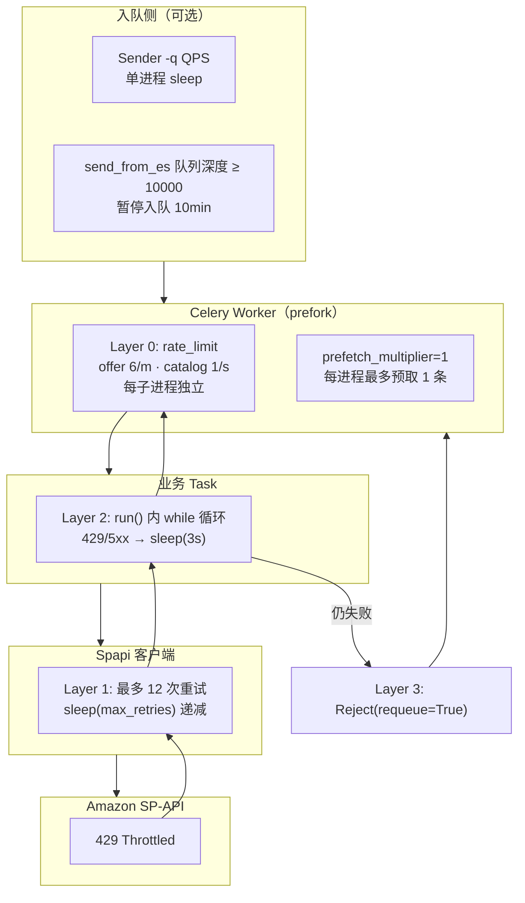
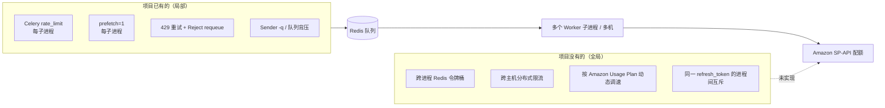
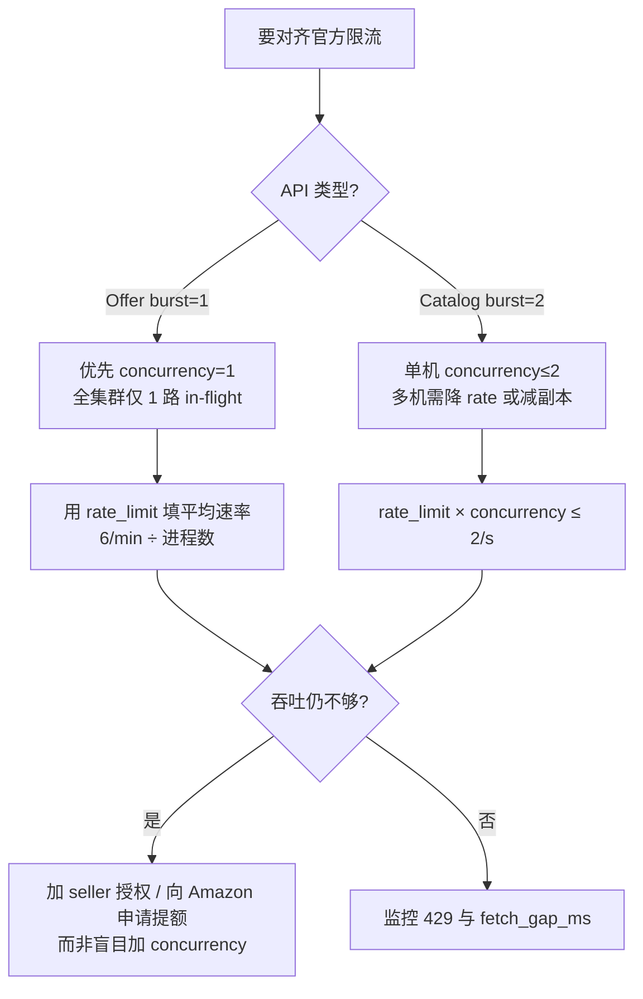

# SP-API 限流与 Celery 多进程协调

本文说明本项目如何应对 Amazon SP-API 限流（429）、Celery **prefork 多进程**下各进程如何（以及**如何不**）协调请求速率，以及运维侧应如何调参。

相关文档：[SPAPI_CORE.md](./SPAPI_CORE.md)、[OFFER_PIPELINE.md](./OFFER_PIPELINE.md)、[PRIORITY_QUEUE.md](./PRIORITY_QUEUE.md)

---

## 1. 问题背景

### 1.1 Amazon 侧限流

SP-API 对每个 **Developer App + Seller 凭证 + API 操作** 有 Usage Plan（速率 + 突发）。超出配额时返回 **HTTP 429**，SDK 映射为 `SellingApiRequestThrottledException`。

本项目主要涉及：

| API | Task | 每次 task 的 HTTP 调用 |
|-----|------|------------------------|
| Products `getItemOffersBatch` | `spapi_update_item_offers` | **1 次** batch（最多 20 ASIN） |
| Catalog `searchCatalogItems` | `spapi_update_catalog_items` | **1 次**（最多 20 ASIN） |

Amazon 的配额是**全局**的：同一套 `[spapi]` 凭证下，所有 Worker 进程、所有主机、同步脚本 `spapi_fetch_item_offers_sync` 的请求**加在一起**都计入同一 Usage Plan。

### 1.3 Amazon 官方限流模型（Token Bucket）

官方文档：[Usage Plans and Rate Limits](https://developer-docs.amazon.com/sp-api/docs/usage-plans-and-rate-limits)

SP-API 使用**令牌桶**：

| 概念 | 含义 |
|------|------|
| **Rate** | 每秒向桶中补充的 token 数（持续调用应低于此值） |
| **Burst** | 桶容量上限；最多可「攒」下这么多 token 后瞬时发出 |
| **一次 HTTP 调用** | 消耗 1 个 token |
| **429** | 桶空时仍发起请求 |

要点：

1. **按「Selling Partner + Application」配对**计桶（同一 `[spapi]` refresh_token + 同一 Developer App 共享配额）。
2. **同一 operation 独立一桶**（`getItemOffersBatch` 与 `searchCatalogItems` 互不影响）。
3. **多维度同时生效，先到先限**：例如 Catalog 同时有 per account-application 与 per application 上限，**先触达的那条**生效。
4. **Marketplace 不拆桶**：同一 seller 账号下不同站点通常仍共享 account-application 配额（桶按授权身份划分，而非按队列名 `SpapiItemOffersUpdate_US` 划分）。
5. **`x-amzn-RateLimit-Limit` 响应头**（20x/400/404 时可能有）：表示 **account-application pair** 下该 operation 的 rate（req/s）。**不能依赖其一定存在**；且**不含** per-application 等其他 plan 的信息。
6. 官方建议 429 时 **指数退避 + jitter**、**均匀分布请求**、**不要 hardcode 固定 sleep**；仍可能偶发 429，应用必须能处理。

官方优化指南：[Optimize Calls to the Selling Partner API](https://developer-docs.amazon.com/sp-api/docs/optimize-calls-to-the-selling-partner-api)

### 1.4 本项目 API 的官方默认配额

以下为 **API Reference / Changelog 公布的默认值**；个别 seller 可能被 Amazon 调高（仍可通过响应头确认）。**以你账号实际返回的 `x-amzn-RateLimit-Limit` 为准。**

#### Product Pricing — `getItemOffersBatch`

| 项 | 默认值 | 来源 |
|----|--------|------|
| Rate | **0.1 req/s**（持续） | [2023-07 下调公告](https://github.com/amzn/selling-partner-api-models/discussions/3595)（由 0.5 降至 0.1） |
| Burst | **1** | 同上 / [Product Pricing 限流调整](https://developer-docs.amazon.com/sp-api/changelog/sp-api-throttling-adjustments) |
| 每请求 ASIN 数 | 1–20 | [getItemOffersBatch Reference](https://developer-docs.amazon.com/sp-api/reference/getitemoffersbatch) |
| 持续吞吐换算 | **6 batch 请求/min** | 0.1 × 60 |

> 2022 年 changelog 中 batch 曾为 0.5 req/s；2023 年 7 月起默认 **0.1 req/s**。若长期未再变更，文档与线上默认值以 Reference + 响应头为准。

#### Catalog Items v2022-04-01 — `searchCatalogItems`（identifier / ASIN）

本项目使用 **identifiers + identifiersType=ASIN**（非 keyword 搜索）。

| 维度 | Rate | Burst | 来源 |
|------|------|-------|------|
| per **account-application pair** | **2 req/s** | **2** | [Catalog Items API Rate Limits](https://developer-docs.amazon.com/sp-api/docs/catalog-items-api-rate-limits) |
| per **application**（全局） | 500 req/s | — | 同上；identifier 搜索适用 |
| keyword 搜索（本项目不用） | 50 req/s per application | — | 同上 |

持续吞吐：account-application 维度约 **120 req/min**；burst=2 表示桶满时最多连续 **2 次**不节流。

#### 与本项目 Celery task 的对应关系

| 官方 operation | 本项目 1 条 Celery task | HTTP 次数 |
|----------------|-------------------------|-----------|
| `getItemOffersBatch` | `spapi_update_item_offers` | 1 |
| `searchCatalogItems` | `spapi_update_catalog_items` | 1 |

因此对齐官方限流时，应控制 **集群内 batch HTTP 请求速率**，而不是 ASIN 条数（batch 内 20 ASIN 仍算 1 token）。

### 1.5 Celery 官方模型

Celery Worker 默认使用 **prefork** 池：`--concurrency N` 会 fork **N 个子进程**，每个子进程独立从 Redis 取 task、独立执行。

官方建议对 I/O 密集型 task（如 HTTP API）使用多进程提高吞吐，但应配合 **task 级 `rate_limit`** 或外部限流，避免打满下游。

**重要：** Celery 的 `rate_limit` 是 **每个 Worker 子进程各自维护** 的令牌桶，**不是**跨进程、跨主机的全局限速。

### 1.6 当前配置 vs 官方默认（差距一览）

假设 **1 个 seller 凭证 + 1 个 app**，推荐 `CELERY_OFFER_CONCURRENCY=1`、`CELERY_CATALOG_CONCURRENCY=2`，单机部署：

| API | 官方持续上限 | 本项目 Layer 0 峰值（单机） | 是否对齐 |
|-----|-------------|---------------------------|----------|
| Offer batch | **6/min**（0.1/s） | 1 × 6/min = **6/min** | **是** |
| Offer burst | **1** 并发 token | 最多 **1** 子进程同时调 API | **是** |
| Catalog | **2/s**（120/min） | 2 × 1/s = **2/s** | **持续速率对齐** |
| Catalog burst | **2** | 2 子进程可同时各 1 次 | **是**（单机） |

---

## 2. 本项目的限流架构（四层）



| 层级 | 位置 | 触发条件 | 行为 | 协调范围 |
|------|------|----------|------|----------|
| **入队 QPS** | `*_task_sender.py`、`-q` | 手动指定 QPS | `sleep(1/qps - elapsed)` | **仅该 Sender 进程** |
| **队列背压** | `*_send_from_es.py` | 队列深度 ≥ 10000 | `sleep(600)` 暂停入队 | 按 Redis 队列名，**不入队**而非限速消费 |
| **Layer 0** | `@app.task(rate_limit=...)` | 进程内 token 耗尽 | Celery 推迟执行该进程的下一条 task | **每个 Worker 子进程** |
| **Layer 1** | `em_tasks/spapi/__init__.py` | 429 / 5xx / 暂时不可用 | `sleep(max_retries)`，最多 12 次 | **该 task 所在子进程** |
| **Layer 2** | `SpapiUpdate*Task.run()` | Layer 1 仍抛 `exceptions_to_retry` | `sleep(3)` 后重试整个 API 调用 | **该 task 所在子进程** |
| **Layer 3** | `em_celery/tasks/spapi_update_*_task.py` | Layer 2 仍失败 | `Reject(requeue=True)` 消息回队列 | 重新排队，**任意** Worker 可再次消费 |

---

## 3. Celery `rate_limit` 与多进程

### 3.1 Task 注解

```python
# em_celery/tasks/spapi_update_item_offers_task.py
@app.task(..., rate_limit='6/m')

# em_celery/tasks/spapi_update_catalog_items_task.py
@app.task(..., rate_limit='1/s')
```

含义（Celery 语义）：

- **`6/m`**：该 **Worker 子进程** 每分钟最多 **开始执行** 6 次 `spapi_update_item_offers`（对齐 0.1 req/s）
- **`1/s`**：该子进程每秒最多 1 次 `spapi_update_catalog_items`

### 3.2 多进程如何**不**协调

prefork 下 **N 个子进程 = N 个独立限速器**，彼此不共享计数器：

```
单机 offer worker，CELERY_OFFER_CONCURRENCY=4：

  子进程 ForkPoolWorker-1  →  8 task/min
  子进程 ForkPoolWorker-2  →  8 task/min
  子进程 ForkPoolWorker-3  →  8 task/min
  子进程 ForkPoolWorker-4  →  8 task/min
  ─────────────────────────────────────
  理论峰值（仅 Layer 0）   →  32 task/min ≈ 32 次 batch HTTP/min
```

若部署 **多台** offer worker、或本地 `--concurrency 1` 与生产 `--concurrency 4` 同时跑，**各自**按 `8/m × concurrency × 机器数` 叠加，**项目内没有 Redis/DB 全局令牌桶** 来对齐 Amazon 配额。

### 3.3 与 Celery 官方建议的关系

| 官方建议 | 本项目做法 |
|----------|------------|
| I/O 型 task 可用多进程 | `CELERY_OFFER_CONCURRENCY=4`（示例配置） |
| 用 `rate_limit` 保护下游 | offer `8/m`、catalog `1/s` |
| 避免单进程 prefetch 过多 | `worker_prefetch_multiplier = 1` |
| 全局限速需额外机制 | **未实现**；靠运维拆分 worker + 429 重试 |

`worker_prefetch_multiplier=1`（`em_celery/config.py`）保证每个子进程最多预取 1 条未 ACK 消息，避免一个进程 hoard 大量 task；**不等于** SP-API 全局限速。

### 3.4 其他 Worker 配置

| 配置 | 值 | 与限流关系 |
|------|-----|------------|
| `task_acks_late=True` | 执行成功才 ACK | 失败可 requeue，不丢消息 |
| `task_reject_on_worker_lost=True` | Worker 崩溃时 requeue | 避免 silent drop |
| `acks_late` + `Reject(requeue=True)` | 429 耗尽重试后 | task 回到 Redis，可能再次被任意进程消费 |

生产并发来自 `/etc/conf.d/em_celery`（见 `deploy/conf.d/em_celery.example`）：

```bash
CELERY_CATALOG_CONCURRENCY=2   # catalog 子进程数
CELERY_OFFER_CONCURRENCY=4     # offer 子进程数
```

本地开发 `local_dev/run_local_worker.sh` 固定 **`--concurrency 1`**，与生产行为不同，限流更保守。

---

## 4. 各层重试细节

### 4.1 Layer 1：`Spapi` 内部

**文件：** `em_tasks/spapi/__init__.py`

```python
max_retries = 12
while max_retries > 0:
    try:
        # get_item_offers_batch / search_catalog_items
        break
    except exceptions_to_retry:
        time.sleep(max_retries)   # 首次 sleep 12s，随后 11s、10s … 1s
        max_retries -= 1
```

`exceptions_to_retry` 含：`SellingApiRequestThrottledException`（429）、5xx、暂时不可用、状态冲突。

403 Forbidden 在抛出前额外 sleep（catalog 3s，offer 7s），然后进入 Celery Layer 3。

### 4.2 Layer 2：业务 Task

**Offer**（`em_tasks/tasks/spapi_update_item_offers_task.py`）：

```python
while True:
    try:
        offers = self.spapi.get_item_offers_batch(...)
        break
    except exceptions_to_retry:
        time.sleep(3)
```

**Catalog**（`em_tasks/tasks/spapi_update_catalog_items_task.py`）同理。

注意：`SpapiUpdateItemOffersTask._last_task_finish_ts` 是**类变量**，仅用于统计 `fetch_gap_ms` 写入 ES，**不参与限速**；fork 后每个子进程有独立副本。

### 4.3 Layer 3：Celery 包装

**Offer** 在 `exceptions_to_retry` 时：

```python
raise Reject(str(e), requeue=True)
```

并维护 `rejected_tasks_cnt`：累计超过 250 次发 Telegram `[SpapiItemOffersRejectedReset]`。

**Catalog** 同样 `Reject(requeue=True)`，无 250 次告警计数。

403 / `AuthorizationError`：Telegram + `app.control.broadcast('shutdown')` 关闭**当前 host 的 worker** + requeue。

---

## 5. 入队侧（Sender）速率控制

Sender **只负责往 Redis 塞 task**，不直接调 SP-API；但若入队过快，会堆高队列、让多进程同时消费，间接放大 429。

### 5.1 可选 QPS（`-q`）

**文件：** `em_celery/tools/spapi_update_item_offers_task_sender.py` 等

```python
if self.last_send_time:
    wait_time = 1 / self.qps - (time.time() - self.last_send_time)
    if wait_time > 0:
        time.sleep(wait_time)
```

- 仅当 CLI 传入 `-q/--qps` 时生效
- **单 Sender 进程**内的相邻 `apply_async` 间隔
- 多个 Sender 同时跑时 **互不协调**
- 未传 `-q` 时无 sleep，按 ES/文件读取速度尽快入队

### 5.2 队列深度背压

**文件：** `em_celery/tools/spapi_update_item_offers_task_send_from_es.py`

```python
self.queue_limit = 10000

def is_queue_full(self):
    return redis_priority_queue_depth(self.redis, self.queue) >= self.queue_limit
# 满则 sleep(60 * 10)
```

这是 **backpressure**（防止 Redis 队列无限增长），不是按 Amazon QPS 精确限速。优先级子队列 `:0`–`:9` 的深度会一并计入（`redis_priority_queue_depth`）。

### 5.3 默认入队行为

| Sender | QPS | 队列背压 |
|--------|-----|----------|
| `spapi_*_task_sender` | 可选 `-q` | 无 |
| `spapi_*_task_send_from_es` | 无 | 10000 |
| `spapi_*_all_*_send_from_es` | 无 | 按 marketplace 轮询 + 背压 |

入队 task **默认 priority 9（bulk，`:9`）**；高优无后缀队列由 `dispatch_task(..., priority=0)` 指定，见 [PRIORITY_QUEUE.md](./PRIORITY_QUEUE.md)。

---

## 6. 有效吞吐估算

在 **仅考虑 Layer 0**、且每个 task 满 20 ASIN、API 一次成功的前提下：

| 场景 | Offer HTTP batch/min | Catalog HTTP/min | 对比官方默认 |
|------|----------------------|------------------|--------------|
| 1 子进程 | 8 | 60 | offer **6** / catalog **120** |
| 4 子进程（示例生产） | 32 | 120（2 子进程 × 1/s） | offer **6** / catalog **120** |
| 2 台 offer worker × concurrency 4 | 64 | — | offer **6** |

实际会更低：429 重试、ES 写入、空 ASIN、Reject requeue 都会拉低有效 QPS。上表说明 **Layer 0 峰值可远高于官方 sustained 上限**（尤其 Offer），429 会由 Layer 1–3 被动消化，但队列延迟与 requeue 成本上升。对齐方法见 §8.2–§8.4。

**同步脚本** `spapi_fetch_item_offers_sync` **不受** Celery `rate_limit` 约束，在同一凭证下跑大批量会与 Worker **争抢** Amazon 配额。

---

## 7. 进程间「协调」结论



**结论：**

1. **Worker 子进程之间不协调 SP-API 速率**；协调发生在「Redis 队列 + 各进程独立 rate_limit + 429 被动退避」这一组合上。
2. **多机 Worker 共享同一 `[spapi]` 凭证时**，Amazon 配额是共享的，Celery 限速是**相乘**关系，需运维按机器数反算 `rate_limit` 与 `concurrency`。
3. **Sender 与 Worker 不协调**；除非 Sender 用 `-q` 或队列背压，否则 Worker 消费速度仅受自身 `rate_limit` 与并发数限制。
4. **`Reject(requeue=True)`** 在持续 429 时会让 task 在队列中循环，可能与其他新 task 交错，**没有**优先级降级或 dead-letter（offer 仅有 Telegram 计数告警）。

---

## 8. 运维调参建议

### 8.1 出现大量 429 时

1. **降低并发**：减小 `CELERY_OFFER_CONCURRENCY` / `CELERY_CATALOG_CONCURRENCY`
2. **降低 task rate**：修改 `@app.task(rate_limit=...)`（需发版）；或临时减少 Worker 实例数
3. **Sender 加 `-q`**：限制入队速率，避免队列堆积后多进程同时爆发
4. **检查多副本**：是否有多台 worker、本地测试 worker 与生产共用凭证
5. **查 ES stats**：`spapi_item_offers_task_stats` 中的 `api_failed`、`fetch_gap_ms`
6. **核对官方实际配额**：对成功响应检查 `x-amzn-RateLimit-Limit`（本项目 **尚未解析该头**，见 §8.6）

### 8.2 与官方 Usage Plan 对齐（核心公式）

官方限制的是 **HTTP 请求速率**（token），不是 Celery task 条数。对齐时需把 **所有共享同一 refresh_token 的消费者** 算进去：

```
集群 sustained req/s  ≈  Σ (每台 worker 的 concurrency × 每进程 rate_limit req/s)

其中：
  每进程 rate_limit req/s = 1 / interval   （如 8/m → 8/60 ≈ 0.133/s）
```

**Offer（`getItemOffersBatch`）— 默认 R=0.1 req/s，B=1：**

```
Σ(concurrency) × (rate_limit_per_min / 60)  ≤  R
⇒  rate_limit_per_min  ≤  R × 60 / Σ(concurrency)
⇒  默认 R=0.1 时：rate_limit_per_min  ≤  6 / Σ(concurrency)
```

| 集群 offer 子进程总数 Σ(concurrency) | 每进程 `rate_limit` 上限（持续） | 备注 |
|--------------------------------------|----------------------------------|------|
| 1 | **6/m** | 与 0.1 req/s 对齐 |
| 2 | **3/m** | |
| 4（单机示例） | **1/m** 或 **2/m** 且 concurrency 降为 2 | 当前 8/m×4 严重超标 |
| 8（2 机×4） | **≤1/m** |  practically 应 **concurrency=1~2 + 全局锁** |

**Burst=1 的额外约束：** 即使平均速率合格，**同一时刻 >1 个进程**同时调用仍可能 429。Offer 侧更安全的形态是：

- **全集群 in-flight offer HTTP ≤ 1**（concurrency=1 或 Redis 分布式信号量），且
- 平均间隔 ≥ **1/R ≈ 10s**（R=0.1 时）

**Catalog（`searchCatalogItems` by ASIN）— 默认 R=2 req/s，B=2：**

```
Σ(concurrency) × (rate_limit_per_sec)  ≤  2   （account-application 维度）
```

| 集群 catalog 子进程总数 | 每进程 `rate_limit` 上限 | 当前 1/s × N |
|-------------------------|--------------------------|--------------|
| 1 | 2/s | OK |
| 2 | 1/s | 与现配置一致 |
| 4 | 0.5/s（30/m） | 2 机×concurrency 2 时会超 |

Catalog burst=2 允许 **短时 2 并发**；多机各自 2 并发会在桶空时叠加触发 429。

### 8.3 配置演算示例

**场景 A：单台 offer worker，要对齐默认 0.1 req/s**

```bash
CELERY_OFFER_CONCURRENCY=1
# 代码中 rate_limit='6/m' 或更保守 '5/m'
```

**场景 B：希望单机略留余量且可偶发 burst（仍可能 429）**

```bash
CELERY_OFFER_CONCURRENCY=1
# rate_limit='4/m'  → ≈0.067/s，低于 0.1/s
```

**场景 C：2 台 offer worker，每台 concurrency=2（Σ=4）**

```bash
# 每进程 ≤ 6/4 ≈ 1.5/min → 用 1/m
# 且接受 burst 风险，或改为每台 concurrency=1、共 2 进程
```

**场景 D：catalog 2 台 × concurrency=2**

```
峰值 4 req/s > 2 req/s  → 将每进程改为 rate_limit='0.5/s' 或降低 concurrency
```

### 8.4 Concurrency 并发数：取舍与推荐

Celery prefork 的 `--concurrency N` 表示 **N 个子进程并行消费队列**。对 SP-API 而言，这 N 路可能 **同时** 各打 1 次 HTTP，与 Amazon **burst** 直接相关。



| 维度 | concurrency 调高 | concurrency 调低 |
|------|------------------|------------------|
| **队列消化** | 多路并行，Redis 积压下降快 | 单路串行，积压消化慢 |
| **Offer burst=1** | 多进程极易同时 429 | 与 token 桶匹配 |
| **CPU** | SP-API task 以 I/O 为主，CPU 往往非瓶颈 | 进程少，内存占用低 |
| **Celery rate_limit** | 总吞吐 = N × 每进程 limit，**相乘** | 总吞吐下降，更易合规 |
| **429 重试风暴** | Reject requeue + 多进程重试，放大延迟 | 退避更可控 |
| **ES 写入** | 略增并行 bulk（通常不是主矛盾） | 影响小 |

**推荐基线（默认 Usage Plan、单 seller 凭证）：**

| Worker 类型 | concurrency | rate_limit（每进程） | 说明 |
|-------------|-------------|----------------------|------|
| Offer | **1**（全集群 offer 合计 1 更稳） | **5–6/m** | 对齐 0.1/s；burst=1 时不并行 HTTP |
| Catalog | **1–2**（单机） | **1/s**（Σ=2 时）或 **0.5/s**（Σ=4 时） | 对齐 2/s account-application |
| 本地开发 | **1**（已固定） | 同生产或更保守 | `run_local_worker.sh` |

**何时可以加大 concurrency？**

- 响应头确认 **R 高于默认**（如 Amazon 提额后 `x-amzn-RateLimit-Limit: 0.5`）。
- **不同 seller** 使用不同 `[spapi]` 凭证，桶彼此独立（按 worker 分组部署）。
- 已实现 **跨进程全局令牌桶 / 信号量**，保证 in-flight 与 sustained 双限。

**何时应减小 concurrency？**

- `spapi_item_offers_task_stats` 中 `api_failed` 或 Reject 告警持续升高。
- 多机/多副本叠加后 429 频繁。
- Offer 与 `spapi_fetch_item_offers_sync` 同步脚本 **共用凭证** 同时运行。

### 8.5 官方建议 vs 本项目实现差距

| 官方建议 | 本项目现状 | 对齐方向 |
|----------|------------|----------|
| 429 指数退避 + jitter | 固定 `sleep(max_retries)`、`sleep(3)` | 可改为读 `Retry-After` / 指数退避（需改代码） |
| 不 hardcode 定时器 | Celery `rate_limit` 固定 8/m、1/s | 按 §8.2 公式重算；或用响应头动态调速 |
| 读 `x-amzn-RateLimit-Limit` | **未解析** | 日志/指标记录该头，用于验证实际 R |
| 均匀分布请求 | 多进程 + Reject requeue 易造成突发 | concurrency=1、Sender `-q`、全局限速 |
| 用 batch API 减调用次数 | 已 batch 20 ASIN | ✓ 已符合 |
| 全集群单桶协调 | 无 Redis 全局 limiter | 运维减副本，或未来实现分布式 token bucket |

### 8.6 如何验证实际配额（运维清单）

1. 对 **成功** 的 SP-API 响应抓包或打日志，查看 `x-amzn-RateLimit-Limit`（req/s）。
2. 用 **单进程**、间隔 10s 调用 offer batch，确认 429 是否消失（验证是否约为 0.1/s）。
3. 临时 `CELERY_OFFER_CONCURRENCY=1` + 改 `rate_limit='6/m'`，观察 429 与队列延迟。
4. Sandbox **不能**模拟生产 rate limit（官方 FAQ）；限流测试必须在 production 凭证上小心进行。
5. 对比 ES `fetch_gap_ms`：若接近 0 且 429 多，说明多进程在抢 burst。

### 8.7 本地 vs 生产

| 项 | 本地 `run_local_worker.sh` | 生产示例 | 对齐官方默认 |
|----|---------------------------|----------|--------------|
| concurrency | 1 | offer 1 / catalog 2 | 与 burst 对齐 |
| rate_limit | 6/m、1/s | 同上 | offer **6/m**（Σ=1）；catalog **1/s**（Σ=2） |
| 有效 offer 峰值 | 8 batch/min | 32 batch/min（单机） | 目标 **≤6 batch/min**（默认 R=0.1） |

---

## 9. 代码索引

| 主题 | 文件 |
|------|------|
| Celery rate_limit | `em_celery/tasks/spapi_update_item_offers_task.py`、`spapi_update_catalog_items_task.py` |
| Worker 配置 | `em_celery/config.py` |
| 生产 concurrency | `em_celery/runtime.py`、`deploy/conf.d/em_celery.example` |
| SP-API 重试 | `em_tasks/spapi/__init__.py` |
| 业务层重试 | `em_tasks/tasks/spapi_update_item_offers_task.py`、`spapi_update_catalog_items_task.py` |
| Reject / shutdown | `em_celery/tasks/spapi_update_*_task.py` |
| Sender QPS | `em_celery/tools/spapi_*_task_sender.py` |
| 队列背压 | `em_celery/tools/spapi_*_send_from_es.py` |
| 队列深度 | `em_celery/scheduling/priority.py` → `redis_priority_queue_depth` |

---

## 10. 常见问题

**Q：官方 `getItemOffersBatch` 限流到底是多少？**  
A：API Reference 与 [2023 公告](https://github.com/amzn/selling-partner-api-models/discussions/3595) 默认 **0.1 req/s、burst 1**（持续约 **6 batch/min**）。历史上曾为 0.5 req/s。以响应头 `x-amzn-RateLimit-Limit` 为准。

**Q：为什么 concurrency=4 容易 429，即使 rate_limit=8/m？**  
A：两层原因：① 8/m×4=32/min **远高于** 6/min 的持续上限；② burst=1 时 **任意 2 个进程同时** 打 API 就可能有一个 429，与平均速率无关。

**Q：Catalog concurrency=2、rate_limit=1/s 算对齐吗？**  
A：**单机**时 2×1/s=2/s，与 account-application 默认 **2 req/s** 一致；burst=2 也匹配。但 **第二台** catalog worker 会翻倍，需降为每进程 0.5/s 或 concurrency=1。

**Q：Celery 官方说多进程，不同进程怎么协调发送速度？**  
A：Celery 仅 **每进程** `rate_limit`；**全局**协调需自建（Redis 令牌桶、单消费者、或 concurrency=1）。Amazon 侧则是 **seller+app 全局单桶**，与 Celery 进程数无关。

**Q：`rate_limit='8/m'` 是 8 个 ASIN 还是 8 次 API？**  
A：**8 条 Celery task**。每条 task 调 **1 次** `getItemOffersBatch`（最多 20 ASIN）。

**Q：priority 队列会影响限流吗？**  
A：不影响 Layer 0 计数方式；高优 task 仍占用同一子进程的 `rate_limit` 配额。优先级只影响 **从 Redis 取消息的先后顺序**。

**Q：多台 worker 监听同一队列会抢配额吗？**  
A：会。它们共享 Amazon **同一 token 桶**，但 Celery 限速 **各自独立**，容易叠加超限。

**Q：为什么 429 后 task 又回到队列？**  
A：Layer 3 `Reject(requeue=True)` 设计为 transient 错误可恢复；副作用是队列延迟增大。官方也要求 429 可重试，但应 **back-off**；本项目固定 sleep，可能造成 requeue 风暴，需配合 §8.4 降低 concurrency。

**Q：能否靠提高 concurrency 加快消化队列？**  
A：对 Offer **通常不能**，burst=1 下只会增加 429 与重试。应优先 **合规 rate + 单路 in-flight**，或拆分多 seller 凭证、向 Amazon 申请更高配额。

---

## 11. 官方文档索引

| 主题 | 链接 |
|------|------|
| Usage Plan 与 Token Bucket | [Usage Plans and Rate Limits](https://developer-docs.amazon.com/sp-api/docs/usage-plans-and-rate-limits) |
| Catalog 各 operation 限流表 | [Catalog Items API Rate Limits](https://developer-docs.amazon.com/sp-api/docs/catalog-items-api-rate-limits) |
| getItemOffersBatch Reference | [getItemOffersBatch](https://developer-docs.amazon.com/sp-api/reference/getitemoffersbatch) |
| 2022 限流调整（含 batch 0.5→0.1 前版本） | [SP-API Throttling Adjustments](https://developer-docs.amazon.com/sp-api/changelog/sp-api-throttling-adjustments) |
| getItemOffersBatch 降至 0.1/s 公告 | [GitHub Discussion #3595](https://github.com/amzn/selling-partner-api-models/discussions/3595) |
| 优化调用与 batch | [Optimize Calls to the Selling Partner API](https://developer-docs.amazon.com/sp-api/docs/optimize-calls-to-the-selling-partner-api) |
| 4xx / 429 处理 | [Mastering SP-API 4xx Error Handling](https://github.com/amzn/selling-partner-api-samples/discussions/195) |
