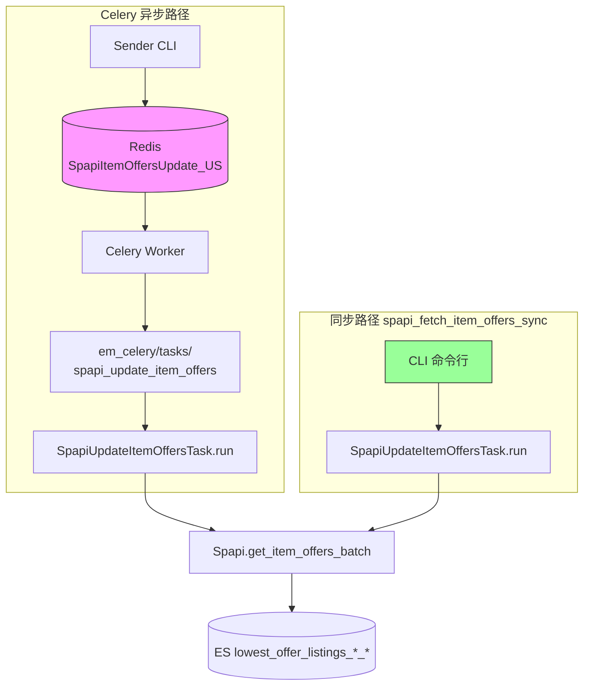
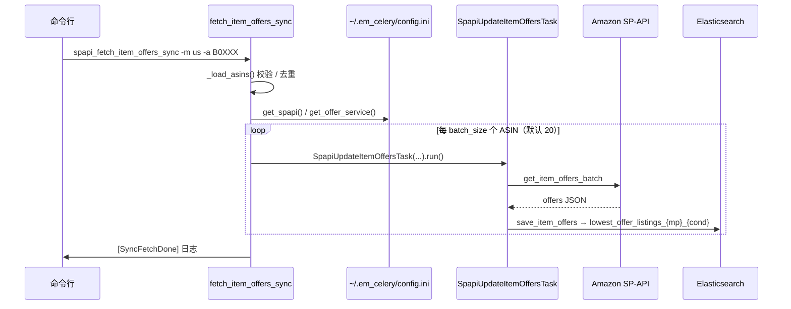

# 同步拉取 Offer：`spapi_fetch_item_offers_sync`

本文说明 **`spapi_fetch_item_offers_sync`** 的实现方式、工作流程，以及它与 Celery 异步路径的关系。

相关文档：[OFFER_PIPELINE.md](./OFFER_PIPELINE.md)（Celery 异步完整链路）、[ENTRY_POINTS.md](./ENTRY_POINTS.md)（程序入口）

---

## 1. 一句话结论

**`spapi_fetch_item_offers_sync` 不读 Redis 队列，与 Celery Worker 监听的队列无关。**

它在当前进程里**直接调用**与 Worker 相同的业务类 `SpapiUpdateItemOffersTask.run()`，同步完成「SP-API 拉 offer → 写 ES」。

| | Celery 异步路径 | 同步脚本 |
|---|----------------|----------|
| 入口 | Sender `apply_async` → Redis | CLI `spapi_fetch_item_offers_sync` |
| 是否用 Redis | ✓ | ✗ |
| 是否用 Worker | ✓ | ✗ |
| 业务类 | `SpapiUpdateItemOffersTask` | **同一个类** |
| SP-API / ES | 相同 | 相同 |

---

## 2. 架构对比



**关键：** 两条路径在 `SpapiUpdateItemOffersTask.run()` 处汇合；同步路径**完全绕过** Redis 与 Celery 包装层。

---

## 3. 实现位置

| 项 | 值 |
|----|-----|
| CLI 命令 | `spapi_fetch_item_offers_sync` |
| 入口函数 | `em_celery.tools.spapi_fetch_item_offers_sync:fetch_item_offers_sync` |
| 源文件 | `em_celery/tools/spapi_fetch_item_offers_sync.py` |
| 核心业务类 | `em_tasks.tasks.spapi_update_item_offers_task.SpapiUpdateItemOffersTask` |

`pyproject.toml` 注册：

```toml
spapi_fetch_item_offers_sync = "em_celery.tools.spapi_fetch_item_offers_sync:fetch_item_offers_sync"
```

---

## 4. 工作流程（逐步）



### 4.1 CLI 解析 ASIN

```python
# em_celery/tools/spapi_fetch_item_offers_sync.py

def _load_asins(asins_path=None, asins=None):
    # 支持 -a B0XXX（可重复）和/或 文件路径参数
    # is_asin_valid() 过滤非法 ASIN，去重
```

ASIN 来源（二选一或组合）：

- `-a / --asin`：命令行多次指定
-  positional `asins_path`：文本文件，每行一个 ASIN

### 4.2 加载依赖（与 Worker 相同配置）

```python
spapi = get_spapi()           # em_celery/__init__.py → [spapi] 凭证
offer_service = get_offer_service()  # [offer_service] → EsOfferService
```

读取 **`~/.em_celery/config.ini`**，**不需要** `BROKER_URL`，**不连接** Redis。

### 4.3 分批同步执行

```python
def fetch_item_offers_sync_impl(marketplace, condition, asins, batch_size=20):
  for i in range(0, len(asins), batch_size):
    chunk = asins[i:i + batch_size]
    task = SpapiUpdateItemOffersTask(spapi, offer_service, marketplace, chunk, condition)
    task.run()
```

- 每批最多 **20** 个 ASIN（与 SP-API batch 上限、Celery task 批量一致）
- `-b/--batch-size` 可调，范围 1–20
- **在当前 shell 进程内阻塞执行**，一批完成再处理下一批

### 4.4 业务类内部（与 Worker 相同）

`SpapiUpdateItemOffersTask.run()`（`em_tasks/tasks/spapi_update_item_offers_task.py`）：

1. `spapi.get_item_offers_batch(marketplace, asins, condition)`
2. `offer_service.save_item_offers('lowest_offer_listings', ...)` → ES 索引 `lowest_offer_listings_{mp}_{cond}`
3. 若传入 `product_service` + `worker`，还会写分钟级 stats；**同步脚本未传这两项**，故**不写** `spapi_item_offers_task_stats`

---

## 5. 与 Celery 路径的差异

### 5.1 同步脚本**没有**的部分

| 组件 | Celery 有 | 同步脚本 |
|------|:---------:|:--------:|
| Redis 队列 `SpapiItemOffersUpdate_*` | ✓ | ✗ |
| Sender / `apply_async` | ✓ | ✗ |
| Celery Worker 消费 | ✓ | ✗ |
| `@app.task` 包装层 | ✓ | ✗ |
| `rate_limit='8/m'` | ✓ | ✗ |
| `Reject` / `Ignore` / 重入队 | ✓ | ✗ |
| Forbidden 时 Telegram + shutdown worker | ✓ | ✗ |
| `worker_meta` / task stats 写 ES | ✓ | ✗（未传 worker） |
| Sender 端 TTL 过滤 | ✓ | ✗（CLI 指定哪些 ASIN 就拉哪些） |

### 5.2 同步脚本**共有**的部分

- `Spapi` 客户端与 SP-API 调用逻辑
- `SpapiUpdateItemOffersTask.run()` 内部重试（`exceptions_to_retry` → sleep 3s）
- `EsOfferService.save_item_offers()` 与目标 ES 索引
- `~/.em_celery/config.ini` 中的 `[spapi]`、`[offer_service]`

### 5.3 异常行为差异

**Celery 路径：** 异常在 `em_celery/tasks/spapi_update_item_offers_task.py` 被捕获 → `Reject(requeue=True)` 或 `Ignore()`，消息回到 broker 或丢弃。

**同步路径：** 异常直接从 `task.run()` 抛出到 CLI 进程，**脚本退出**（非零 exit code），**不会**写入 Redis 队列。

---

## 6. 使用场景

| 场景 | 推荐路径 |
|------|----------|
| 验证 SP-API 凭证是否正常 | **同步脚本** |
| 验证 ES `[offer_service]` 写入是否正常 | **同步脚本** |
| 紧急补几个 ASIN 的 offer，不想等队列 | **同步脚本** |
| 批量、持续、多 marketplace 刷新 | Celery Sender + Worker |
| 需要优先级队列（`:9` bulk 分离） | Celery |
| 需要 rate limit、失败重入队 | Celery |

本地测试分层中的 **L4**（见 [LOCAL_TESTING.md](../local_dev/LOCAL_TESTING.md)）即为此脚本。

---

## 7. 命令示例

```bash
# 单个 / 多个 ASIN
spapi_fetch_item_offers_sync -m us -a B0D1XD1ZV3
spapi_fetch_item_offers_sync -m us -a B012345678 -a B098765432

# 从文件读取 ASIN 列表
spapi_fetch_item_offers_sync -m uk local_dev/sample_asins.txt

# 指定 condition、batch size
spapi_fetch_item_offers_sync -m ca -c new -b 10 -a B0XXXXXX
```

**依赖：**

- `~/.em_celery/config.ini` 中有效的 `[spapi]`、`[offer_service]`
- **不需要** Redis / `BROKER_URL` / 运行中的 Worker

**预期日志：**

```
[SyncFetchStart] marketplace=us count=1
[OffersFetched] marketplace=us asins=['B0D1XD1ZV3']
[SyncFetchDone] marketplace=us count=1
```

---

## 8. 常见问题

**Q：会和 Worker 抢同一个 Redis 队列吗？**  
A：**不会。** 同步脚本不连接 Redis，不读、不写任何 Celery 队列。

**Q：写进去的 ES 数据和 Worker 一样吗？**  
A：offer 主索引 `lowest_offer_listings_{mp}_{cond}` 的文档结构相同；同步路径默认**不写** task stats 索引。

**Q：能否代替 Sender 批量生产任务？**  
A：不适合。同步脚本在当前进程串行执行，无队列缓冲、无 Worker 水平扩展、无 Celery rate limit。大批量应使用 Sender → Redis → Worker。

**Q：与 `spapi_item_offers_task_sender` 的区别？**  
A：Sender 只**入队**（还可做 ES TTL 过滤）；同步脚本**立即执行** SP-API 并写 ES，全程不经 Celery。

---

## 9. 代码索引

```
em_celery/tools/spapi_fetch_item_offers_sync.py   ← CLI 入口 + fetch_item_offers_sync_impl
em_tasks/tasks/spapi_update_item_offers_task.py   ← SpapiUpdateItemOffersTask.run()
em_tasks/spapi/__init__.py                        ← Spapi.get_item_offers_batch
vendor/dropshipping/.../offer_services.py         ← EsOfferService.save_item_offers
em_celery/__init__.py                             ← get_spapi(), get_offer_service()
```

Celery 包装层（同步路径不经过）：

```
em_celery/tasks/spapi_update_item_offers_task.py  ← @app.task spapi_update_item_offers
em_celery/worker.py                               ← Celery app
```
