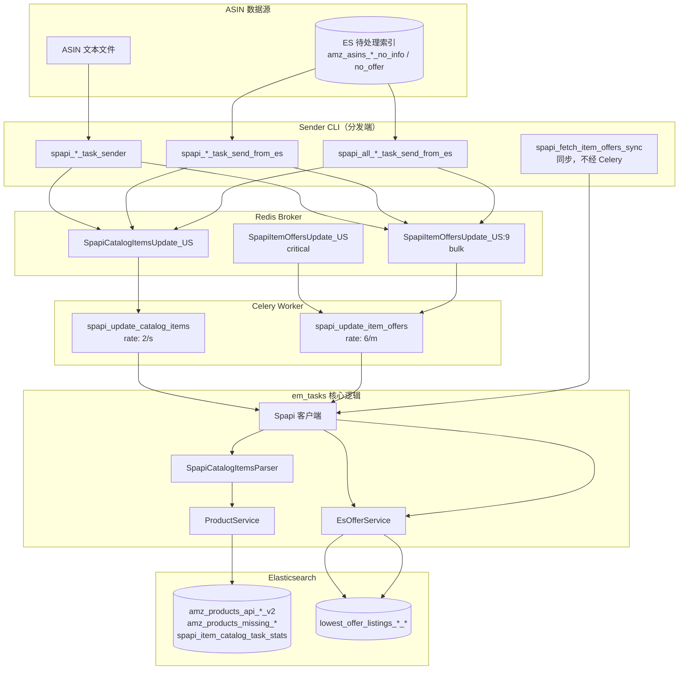
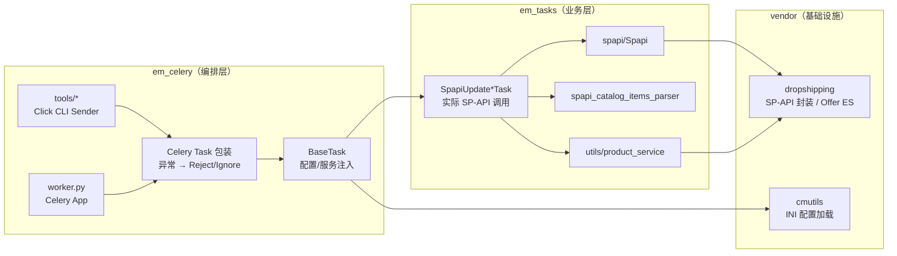
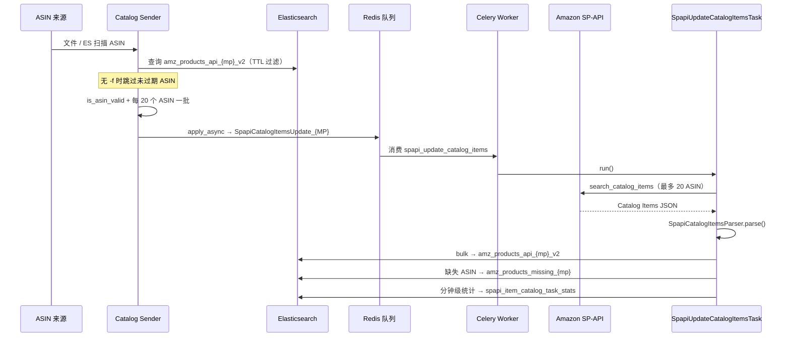
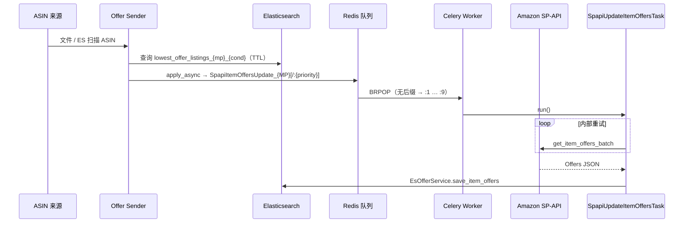
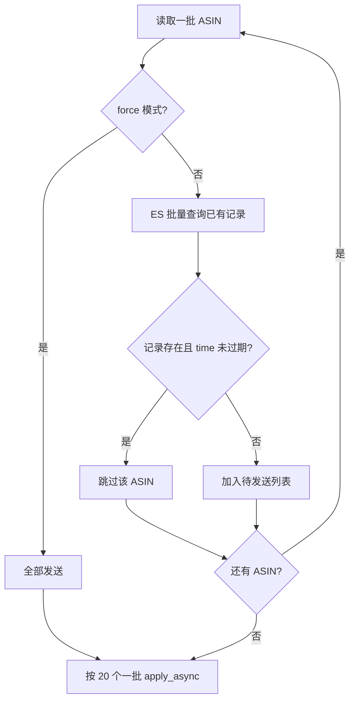
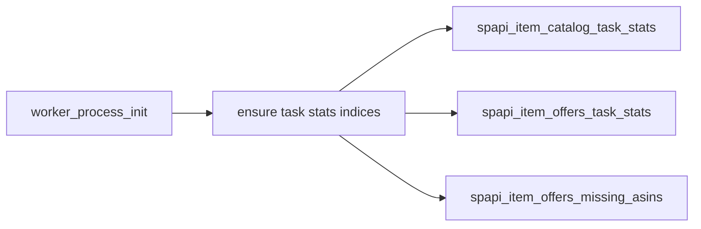
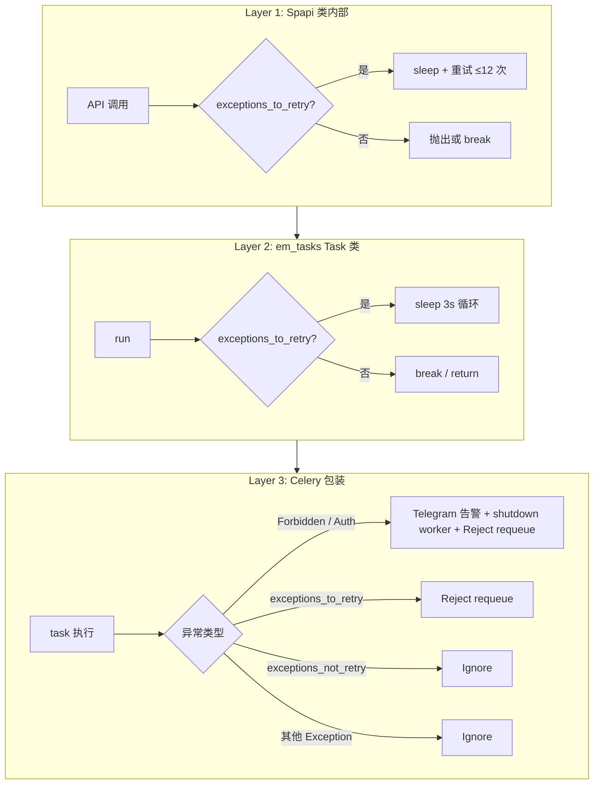
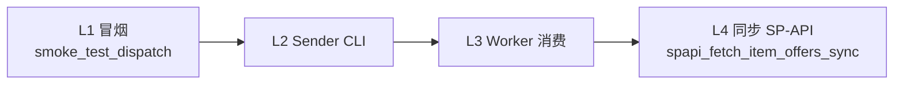
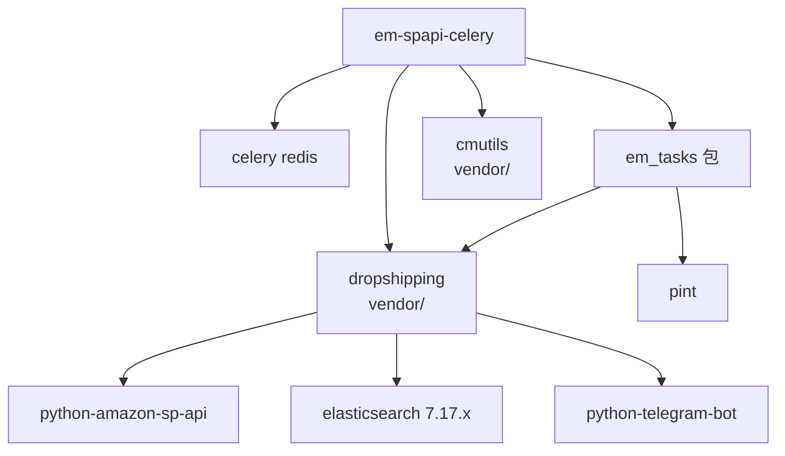

# em-spapi-celery 技术文档

本文描述 SP-API Catalog / Offer 采集管道的架构、数据流、组件职责与运维要点。

**专题文档（建议精读）：**

| 文档 | 内容 |
|------|------|
| [ENTRY_POINTS.md](./ENTRY_POINTS.md) | 程序入口、CLI / Worker 启动、目录职责、学习顺序 |
| [SPAPI_CORE.md](./SPAPI_CORE.md) | SP-API 如何发起请求、返回结构与转换 |
| [SPAPI_AUTH_ISOLATION.md](./SPAPI_AUTH_ISOLATION.md) | 多 Worker / 多 VPS 授权隔离、混用与账号关联风险 |
| [SPAPI_RATE_LIMITING.md](./SPAPI_RATE_LIMITING.md) | SP-API 限流、Celery 多进程与速率协调 |
| [OFFER_PIPELINE.md](./OFFER_PIPELINE.md) | Offer 从入队到写 ES 的逐步代码走读 |
| [SYNC_FETCH_OFFERS.md](./SYNC_FETCH_OFFERS.md) | 同步脚本 `spapi_fetch_item_offers_sync`（不经 Celery） |
| [PRIORITY_QUEUE.md](./PRIORITY_QUEUE.md) | Redis 优先级子队列（无后缀 critical → `:9` bulk）机制 |

---

## 1. 项目概述

`em-spapi-celery` 从 [em-celery](https://github.com/VG-IT/em-celery) 剥离，专注于：

- 通过 **Amazon SP-API** 拉取商品 Catalog 与 Item Offers
- 将结果写入 **Elasticsearch**
- 使用 **Celery + Redis** 异步调度，支持多 marketplace、TTL 去重、限流、**Redis 优先级子队列**（与 em-workers 对齐）

典型使用场景：批量 ASIN 需要定期刷新 catalog 属性或 competitive offer，由 Sender 投递任务、Worker 消费并回写 ES。高优 offer 刷新通过 `priority=0` 进入 `SpapiItemOffersUpdate_{MP}`（无后缀）子队列，优先于 bulk（`:9`）被消费。

### 技术栈

| 层级 | 技术 |
|------|------|
| 语言 / 运行时 | Python 3.12（见 `.python-version`） |
| 依赖管理 | [uv](https://docs.astral.sh/uv/) + `pyproject.toml` |
| 任务队列 | Celery 5.x + Redis broker |
| 外部 API | Amazon SP-API（Catalog Items、Products Pricing） |
| 存储 | Elasticsearch **7.17.10**（`product_service` / `offer_service`；Python 客户端 `elasticsearch>=7.17,<8`） |
| 私有库 | `vendor/dropshipping`、`vendor/cmutils`（本地 vendored） |

---

## 2. 系统架构



### 分层职责



| 目录 | 职责 |
|------|------|
| `em_celery/` | Celery 应用、Task 薄包装、CLI Sender、全局配置工厂 |
| `em_tasks/` | SP-API 调用、解析、ES 读写、任务业务逻辑 |
| `vendor/dropshipping/` | SP-API 客户端封装、`EsOfferService`、ASIN 校验 |
| `vendor/cmutils/` | `IniConfigLoader`、日志工具 |
| `local_dev/` | 本地 Redis/ES、冒烟脚本、worker 启动脚本 |
| `docs/` | 技术文档（见上方专题文档表） |

---

## 3. 端到端数据流

### 3.1 Catalog（商品目录）流程



### 3.2 Offer（报价）流程

> 逐步代码走读见 [OFFER_PIPELINE.md](./OFFER_PIPELINE.md)；优先级子队列见 [PRIORITY_QUEUE.md](./PRIORITY_QUEUE.md)。



### 3.3 Sender TTL 过滤逻辑



默认 TTL：

| 类型 | Sender 参数 | 默认值 | 对照 ES 索引 |
|------|-------------|--------|--------------|
| Catalog | `-t` | 168 小时 | `amz_products_api_{mp}_v2` |
| Offer（文件） | `-t` | 36 小时 | `lowest_offer_listings_{mp}_{condition}` |

---

## 4. Celery 任务

Worker 通过 Celery 官方 `autodiscover_tasks(['em_celery'], force=True)` 加载 `em_celery.tasks` 包；具体 task 在 `em_celery/tasks/__init__.py` 中**显式导出**：

```python
# em_celery/worker.py
app = Celery('em_celery')
app.config_from_object('em_celery.config')
app.autodiscover_tasks(['em_celery'], force=True)

# em_celery/tasks/__init__.py
from em_celery.tasks.spapi_update_catalog_items_task import spapi_update_catalog_items
from em_celery.tasks.spapi_update_item_offers_task import spapi_update_item_offers
```

新增 task 时：在 `tasks/` 下新建模块并加上 `@app.task`，然后在 `tasks/__init__.py` 中增加一行 import 与 `__all__` 条目。

### 4.1 任务一览

| 任务名 | 队列 | 限流 | 参数 | 底层类 |
|--------|------|------|------|--------|
| `em_celery.tasks.spapi_update_catalog_items_task.spapi_update_catalog_items` | `SpapiCatalogItemsUpdate_{MARKETPLACE}` | `2/s` | `marketplace, asins[, ttl, force, callback]` | `SpapiUpdateCatalogItemsTask` |
| `em_celery.tasks.spapi_update_item_offers_task.spapi_update_item_offers` | `SpapiItemOffersUpdate_{MARKETPLACE}` | `6/m` | `marketplace, asins[, condition, ttl, force, callback]` | `SpapiUpdateItemOffersTask` |

> **说明**：Celery 任务签名中的 `ttl` / `force` / `callback` 在 Worker 侧**未使用**；TTL 过滤仅在 Sender 端完成。

### 4.2 任务配置（`em_celery/config.py`）

| 配置项 | 值 | 含义 |
|--------|-----|------|
| `task_acks_late` | `True` | 任务执行完才 ACK |
| `task_reject_on_worker_lost` | `True` | Worker 丢失时重新入队 |
| `task_ignore_result` | `True` | 不存储任务结果 |
| `task_create_missing_queues` | `True` | 自动创建队列 |
| `task_default_priority` | `9` | 未指定 priority 时进 bulk 队列（`:9`） |
| `task_queue_max_priority` | `9` | 优先级上限（0 最高） |
| `broker_transport_options` | `priority_steps` + `sep: ":"` | Redis 优先级子队列（Celery 官方语义） |
| `worker_prefetch_multiplier` | `1` | 配合优先级公平消费 |
| `broker_url` | `BROKER_URL` 环境变量 | Redis 地址 |

Worker 通过 `broker_transport_options` 消费顺序为无后缀（0）→ `:1` → … → `:9`。详见 [PRIORITY_QUEUE.md](./PRIORITY_QUEUE.md)。

### 4.3 Worker 启动

```bash
export BROKER_URL=redis://127.0.0.1:6379/0
celery -A em_celery.worker worker \
  -Q SpapiCatalogItemsUpdate_US,SpapiItemOffersUpdate_US \
  -l info --concurrency 1
```

或使用 `local_dev/run_local_worker.sh`（需设置 `MARKETPLACE` 环境变量，如 `export MARKETPLACE=US`）。

### 4.4 Worker 初始化信号



每个 fork 子进程执行一次（`em_celery/worker.py`），预创建 Catalog/Offer 监控索引。Catalog 写入 `spapi_item_catalog_task_stats`；Offer 写入 `spapi_item_offers_task_stats`（均用 `marketplace` 字段区分站点）。

---

## 5. CLI 工具

入口定义在 `pyproject.toml` 的 `[project.scripts]`，安装后可直接调用。

### 5.1 文件数据源

| 命令 | 说明 | 主要参数 |
|------|------|----------|
| `spapi_catalog_items_task_sender` | 从文件读 ASIN，发送 catalog 任务 | `-b` broker（必填）、`-m` marketplace、`-t` TTL 小时、`-f` 强制、`-q` QPS、`asins_path` |
| `spapi_item_offers_task_sender` | 从文件读 ASIN，发送 offer 任务 | 同上 + `-c` condition（默认 `new`） |

### 5.2 Elasticsearch 数据源（单 marketplace）

| 命令 | 读取索引（默认） | 行为 |
|------|------------------|------|
| `spapi_catalog_items_task_send_from_es` | `amz_asins_{mp}_no_info` | 无限循环扫描，队列 ≥10000 暂停 10 分钟，每轮间隔 30 分钟 |
| `spapi_item_offers_task_send_from_es` | `amz_asins_{mp}_no_offer` | 同上 |

可用 `-i` 覆盖源索引名。

### 5.3 Elasticsearch 数据源（全 marketplace）

| 命令 | marketplace 列表 |
|------|-------------------|
| `spapi_all_catalog_items_task_send_from_es` | us, uk, de, es, it, jp, ca, mx, ae, in, fr, pl, be, nl |
| `spapi_all_item_offers_task_send_from_es` | 同上 |

队列控制：长度 ≤100 才发送；≥10000 停止；日本 catalog 每批 10 ASIN，其余 20。

### 5.4 同步工具（不经 Celery）

| 命令 | 说明 |
|------|------|
| `spapi_fetch_item_offers_sync` | 直接调用 `SpapiUpdateItemOffersTask.run()` 写 ES；**不读 Redis 队列** |

详见 [SYNC_FETCH_OFFERS.md](./SYNC_FETCH_OFFERS.md)。

```bash
spapi_fetch_item_offers_sync -m us -a B0D1XD1ZV3
```

### 5.5 日志位置

Sender 自动写入：

- `~/.em_celery/logs/spapi_update_catalog_items_task_sender.log`
- `~/.em_celery/logs/spapi_update_item_offers_task_sender.log`

---

## 6. 核心模块

> SP-API 请求/响应细节见 [SPAPI_CORE.md](./SPAPI_CORE.md)。限流与多进程协调见 [SPAPI_RATE_LIMITING.md](./SPAPI_RATE_LIMITING.md)。

### 6.1 `Spapi`（`em_tasks/spapi/__init__.py`）

| 方法 | SP-API | 说明 |
|------|--------|------|
| `search_catalog_items(asins, marketplace)` | Catalog Items `search_catalog_items` | 最多 20 ASIN，内部最多重试 12 次 |
| `get_item_offers_batch(marketplace, asins, condition)` | Products `get_item_offers_batch` | 经 `SpItemOfferBatchConverter` 转换 |

支持 22 个 marketplace（`marketplaceIdList` / `marketplaceRegions`）。

**异常分类：**

| 元组 | 典型异常 | 处理策略 |
|------|----------|----------|
| `exceptions_to_retry` | 限流、5xx、暂时不可用 | 睡眠后重试 |
| `exceptions_not_retry` | 404、403、格式错误 | 放弃重试 |

### 6.2 `SpapiUpdateCatalogItemsTask`

路径：`em_tasks/tasks/spapi_update_catalog_items_task.py`

1. 调用 `Spapi.search_catalog_items`
2. `SpapiCatalogItemsParser.parse()` 解析标题、品牌、尺寸、类目、图片等
3. `ProductService.save_products()` → `amz_products_api_{mp}_v2`
4. 未返回的 ASIN → `amz_products_missing_{mp}`
5. 按 worker + marketplace + 分钟聚合运行指标 → `spapi_item_catalog_task_stats`

### 6.3 `SpapiUpdateItemOffersTask`

路径：`em_tasks/tasks/spapi_update_item_offers_task.py`

1. 循环调用 `get_item_offers_batch`（`exceptions_to_retry` 时 sleep 3s）
2. `offer_service.save_item_offers('lowest_offer_listings', ...)` 写入 ES

### 6.4 `ProductService`

路径：`em_tasks/utils/product_service.py`

Elasticsearch 封装：`ensure_indice`、`search_products`、`save_products`（bulk）、`load_products_by_after_search` 等。搜索/扫描使用 `dropshipping.utils.es_service.es_retry` 装饰器。

### 6.5 `BaseTask`

路径：`em_celery/tasks/base.py`

为 Celery 任务提供懒加载属性：

| 属性 | 来源 |
|------|------|
| `spapi` | `[spapi]` 配置段凭证 |
| `product_service` | `get_product_service()` |
| `offer_service` | `get_offer_service()` |
| `bot` | Telegram 告警机器人 |
| `cfg` | `get_config()` |

---

## 7. 异常处理

> 限流（429）与 Celery 多进程下的速率协调详见 [SPAPI_RATE_LIMITING.md](./SPAPI_RATE_LIMITING.md)。

三层重试 / 处置结构：



| Celery 结果 | 含义 |
|-------------|------|
| `Reject(requeue=True)` | 消息回到 broker，稍后重试 |
| `Ignore()` | 丢弃任务，不重试 |
| `acks_late=True` | 仅在任务结束后 ACK |

Offer 任务在累计 250 次 `Reject` 后会发 Telegram 重置通知。

---

## 8. Elasticsearch 索引

### 8.1 输入索引（Sender 读取 ASIN）

| 索引模式 | 用途 |
|----------|------|
| `amz_asins_{marketplace}_no_info` | 待补 catalog 的 ASIN |
| `amz_asins_{marketplace}_no_offer` | 待补 offer 的 ASIN |

### 8.2 输出索引

| 索引 | 写入方 | 文档内容 |
|------|--------|----------|
| `amz_products_api_{marketplace}_v2` | Catalog Task | 解析后的商品属性 + `time` |
| `amz_products_missing_{marketplace}` | Catalog Task | SP-API 未返回的 ASIN |
| `spapi_item_catalog_task_stats` | Catalog Task | 全部 marketplace 共用；`marketplace` 字段区分站点 |
| `lowest_offer_listings_{marketplace}_{condition}` | Offer Task / EsOfferService | offer 列表 + `summary` + `time` |
| `spapi_item_offers_task_stats` | Offer Task | 全部 marketplace 共用；`marketplace` 字段区分站点 |
| `spapi_item_offers_missing_asins` | Worker init 预创建 | 当前未写入 |

---

## 9. 配置

### 9.1 配置文件

| 项 | 值 |
|----|-----|
| 默认路径 | `~/.em_celery/config.ini` |
| 样例 | `local_dev/config.ini.sample` |

### 9.2 INI 配置段

| 段 | 键 | 用途 |
|----|-----|------|
| `[spapi]` | `lwa_refresh_token`, `lwa_client_id`, `lwa_client_secret` | SP-API LWA OAuth 凭证（见 [SPAPI_CORE.md §2](./SPAPI_CORE.md#22-依据为何不需要-aws_access_key--aws_secret_key)） |
| `[product_service]` | `host`, `port`, `user`, `password` | Catalog ES（**7.17.10**） |
| `[offer_service]` | `host`, `port`, `user`, `password` | Offer ES（**7.17.10**） |
### 9.3 环境变量

| 变量 | 用途 |
|------|------|
| `BROKER_URL` | Celery Redis broker（Worker 与 Sender **必须**设置；见 `/etc/conf.d/em_celery`） |
| `ENV` | `em_tasks` 日志级别：`dev` → DEBUG，否则 INFO |
| `MARKETPLACE` | `run_local_worker.sh` 队列后缀（**必填**，如 `US`） |

---

## 10. 本地开发与测试

详见 [`local_dev/LOCAL_TESTING.md`](../local_dev/LOCAL_TESTING.md)。



| 层级 | 需要 Redis | 需要 ES | 需要 SP-API |
|------|:----------:|:-------:|:-----------:|
| L1 | ✓ | ✗ | ✗ |
| L2 | ✓ | ✓ | ✗ |
| L3 | ✓ | ✓ | ✓ |
| L4 | ✗ | ✓ | ✓ |

```bash
# 环境
uv sync
docker compose -f local_dev/docker-compose.yml up -d
export BROKER_URL=redis://127.0.0.1:6379/0

# L1
python local_dev/smoke_test_dispatch.py
python local_dev/inspect_queue.py --broker "$BROKER_URL" --marketplace us
```

---

## 11. 依赖关系



| 包 | 主要用途 |
|----|----------|
| `dropshipping` | SP-API 封装、`EsOfferService`、`is_asin_valid`、`es_retry` |
| `cmutils` | `IniConfigLoader` |
| `celery[redis]` | 异步任务 |
| `click` | CLI |
| `pint` | catalog 尺寸/重量单位换算 |

---

## 12. 文件索引

```
em-spapi-celery/
├── pyproject.toml              # uv 依赖、CLI 入口、包发现
├── .python-version             # Python 3.12
├── em_celery/
│   ├── worker.py               # Celery app + autodiscover_tasks
│   ├── config.py               # Celery 配置（含 priority）
│   ├── runtime.py              # 生产 worker 队列/并发解析
│   ├── __init__.py             # get_config / get_*_service
│   ├── scheduling/             # 优先级队列（Celery 官方 Redis priority）
│   ├── tasks/
│   │   ├── __init__.py         # 显式导出已注册 task
│   │   ├── base.py             # BaseTask
│   │   ├── spapi_update_catalog_items_task.py
│   │   └── spapi_update_item_offers_task.py
│   └── tools/                  # 7 个 CLI Sender
├── em_tasks/
│   ├── spapi/                  # Spapi 客户端 + parser
│   ├── tasks/                  # SpapiUpdate*Task 实现
│   └── utils/product_service.py
├── vendor/
│   ├── dropshipping/
│   └── cmutils/
├── local_dev/                  # 本地测试工具
├── tests/scheduling/           # 优先级队列测试
└── docs/
    ├── TECHNICAL.md            # 本文档
    ├── ENTRY_POINTS.md         # 程序入口指南
    ├── OFFER_PIPELINE.md       # Offer 端到端流程
    └── PRIORITY_QUEUE.md       # 优先级队列机制
```

---

## 13. 常见问题

**Sender 没有发出 task（无报错）**  
未加 `-f` 时，Sender 会先查 ES：若 ASIN 在索引中且 `time` 未过期，则跳过。本地测试请加 `-f`。

**消息进队列但 Worker 不消费**  
检查 Worker 的 `-Q` 是否与队列名完全一致（含 `_US` 大小写），以及 `BROKER_URL` 是否相同。

**Worker task 失败 / Ignore**  
检查 `~/.em_celery/config.ini` 中 `[spapi]` 凭证与 `[product_service]` / `[offer_service]` ES 地址。

**Forbidden 后 Worker 自动 shutdown**  
Catalog/Offer 任务遇到 `SellingApiForbiddenException` 会广播 shutdown 并 `Reject` 重入队，需检查 SP-API 权限与配额。
